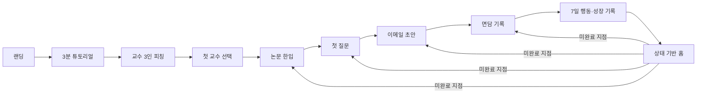

# 상태 기반 서비스 허브 흐름

기준일: 2026-08-23

대상 화면: `/home`

## 1. 홈의 역할

홈은 기능을 같은 무게로 나열하는 메뉴가 아니다. 사용자의 실제 저장 상태를 읽고, 지금 이어갈 행동 하나를 가장 먼저 제시하는 서비스 허브다.

중요 계약:

- 튜토리얼 직후에는 홈이 아니라 약속한 교수 피칭을 먼저 보여준다.
- 교수를 선택한 뒤부터 홈이 재방문 허브 역할을 한다.
- 홈의 1순위 CTA는 언제나 현재 미완료 단계 하나다.
- 사용자가 연구 아이디어를 만들지 않았어도 튜토리얼의 고민 맥락으로 대화 준비를 이어간다.

## 2. 상태별 첫 행동

| 저장 상태 | 제목 | 주 CTA | 다음 화면 |
| --- | --- | --- | --- |
| 고민 맥락 없음 | 막막한 고민부터 가볍게 정리해 볼까요? | 3분 방향 찾기 | `/tutorial` |
| 고민 맥락 있음·교수 결과 없음 | 이제 누구와 이야기할지 찾아볼까요? | 교수 찾기 이어가기 | `/professors` |
| 교수 결과 있음·선택 없음 | 첫 대화를 나눌 교수를 선택해 볼까요? | 교수 피칭 보기 | `/professors/pitch` |
| 교수 선택·논문 기록 없음 | 교수님의 연구를 먼저 한입 살펴볼까요? | 논문 한입 시작하기 | `/paper/reader?mode=bite&source=favorites` |
| 논문 완료·첫 질문 없음 | 이제 첫 질문을 준비해 볼까요? | 대화 준비 이어가기 | `/quest/first-line` |
| 첫 질문 완료·이메일 없음 | 첫 연락을 보내기 전에 점검해 볼까요? | 이메일 준비하기 | `/quest/email-guard` |
| 이메일 완료·면담 기록 없음 | 면담에서 얻은 조언을 다음 행동으로 바꿔 볼까요? | 면담 기록 이어가기 | `/mentor-loop` |
| 전 단계 완료 | 지금까지의 변화를 한 번 돌아볼까요? | 성장 기록 보기 | `/portfolio` |

## 3. 화면·워크플로 책임

| 화면 | 목적 | 주 행동 | 종료 상태 |
| --- | --- | --- | --- |
| `/tutorial` | 자연스럽게 고민 데이터 수집 | 기본 또는 심층 질문 완료 | 실제 교수 매칭 요청 |
| `/professors/pitch` | 공식 근거로 서로 다른 교수 역할 비교 | 첫 교수 선택 | `selectedProfessorId` 저장 |
| `/home` | 현재 상태에 맞는 다음 행동 제안 | 한 단계 이어가기 | 해당 도구로 이동 |
| `/paper/reader` | 교수 공식 논문을 대화 재료로 정리 | 논문 한입 카드 저장 | `paper-bite` 카드 저장 |
| `/quest/first-line` | 첫 대화 문장·질문 준비 | 학생이 수정·저장 | `first-line` 카드 저장 |
| `/quest/email-guard` | 연락 초안 검토 | 학생이 검토·복사 | Knock Kit 저장 |
| `/mentor-loop` | 면담 조언을 다음 행동으로 변환 | 피드백·7일 행동 저장 | Mentor Loop 저장 |
| `/portfolio` | 준비하고 바뀐 과정 확인 | 기록 검토·내보내기 | 사용자 선택으로 내보내기 |

## 4. 데이터 계약

| 데이터 | 출처 | 홈에서 쓰는 의미 | 빈 상태 처리 |
| --- | --- | --- | --- |
| `professorDiscoveryTopic` | 튜토리얼에서 학생이 확인한 입력 | 연구주제 없이 시작한 학생의 대화 맥락 | 없으면 튜토리얼로 안내 |
| `professorMatches` | 대학 공식 교수 정보 + 연결 규칙 | 교수 후보 존재 여부 | 교수 찾기로 안내 |
| `selectedProfessorId`·즐겨찾기 | 학생 선택 | 첫 교수 연결 | 피칭으로 안내 |
| `selectedProfessorPaper` | 학생이 고른 공식 프로필 논문 | 논문 준비 시작 여부 | 논문 한입 CTA |
| 퀘스트 카드 | 학생이 저장한 결과 | 첫 질문·이메일·다음 행동 완료 여부 | 미완료로 표시 |
| Knock Kit·Mentor Loop | 학생 입력·편집 | 연락 준비와 면담 후 행동 완료 여부 | 해당 도구 CTA |

홈은 저장되지 않은 결과를 예시로 채우거나 완료로 계산하지 않는다.

## 5. 예외 흐름

- 공식 교수 결과가 0명: 입력을 유지하고 `/professors` 재시도로 연결한다.
- 논문이 공식 프로필에 미기재: 논문이 없다고 단정하지 않고 직접 입력 또는 첫 질문으로 건너뛸 수 있다.
- AI 분석 실패: 교수 선택과 학생 입력을 지우지 않고 수동 정리로 전환한다.
- 새로고침: Zustand 저장소 복원 전에는 로딩 상태만 표시하고 잘못된 빈 홈을 먼저 그리지 않는다.
- 직접 교수 연결 경로: 선택 교수는 즐겨찾기 여부와 무관하게 논문 선택 목록에 포함한다.
- 연구주제 미생성: 튜토리얼에서 확인한 고민을 학생 맥락으로 변환해 이메일·면담 기록까지 이어간다.
