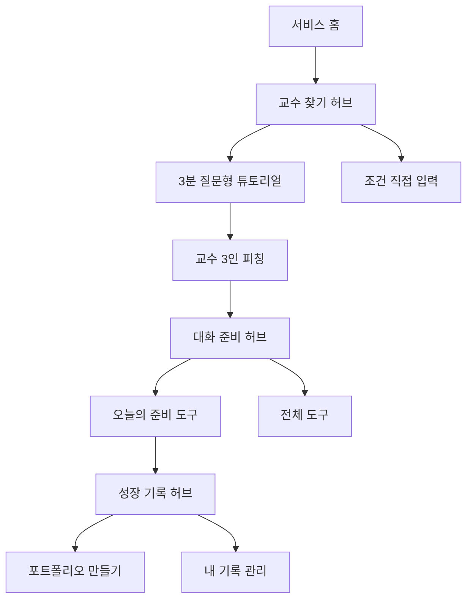

# 서비스 허브 V1 — 토스·당근 구조 원칙 반영

기준일: 2026-08-23

## 목표

기능이 늘어난 뒤 첫 화면에서 너무 많은 설명·선택지·편집 기능을 동시에 보여주던 문제를 해결한다. 기능을 삭제하지 않고 `허브 → 오늘의 한 과업 → 전용 상세 화면`으로 분리한다.

## 공식 레퍼런스에서 가져온 원칙

### 토스

- [Easy to answer](https://toss.tech/article/insurance-claim-process): 사용자가 진행 방식을 추상적으로 고르게 하지 않고 지금 답할 수 있는 쉬운 질문으로 바꾼다.
- [불필요한 클릭 없애기](https://toss.tech/article/4-ways-for-minimum-input): 이미 알고 있는 정보는 다시 묻지 않고, 단일 선택 뒤의 불필요한 확인 행동을 줄인다.

적용: 첫 화면에서 다음 행동 하나만 강조하고, 저장된 상태에 따라 CTA를 바꾼다.

### 당근

- [SEED 디자인 시스템](https://seed-design.io/get-started): 색·타이포·간격·컴포넌트·모션을 공통 언어로 관리한다.
- [당근 피드의 개인화](https://careers.daangn.com/blog/post/%EB%8F%99%EB%84%A4-%EC%86%8C%EC%8B%9D-%EC%97%B0%EA%B2%B0%ED%95%98%EB%8A%94-%EC%8A%88%ED%8D%BC-%ED%94%BC%EB%93%9C%EB%A5%BC-%ED%96%A5%ED%95%98%EC%97%AC/): 많은 콘텐츠를 모두 같은 방식으로 보여주지 않고 사용자가 관심 가질 정보를 선별한다.

적용: 일상적인 한국어, 익숙한 행 목록, 공통 하단 내비게이션, 현재 단계에 맞는 정보 선별을 사용한다.

두 플랫폼의 상표·색·화면을 복제하지 않고 구조 원칙만 우리 브랜드에 적용한다.

## 새 정보 구조

## 화면 계약

| 허브 | 목적 | 첫 화면의 주 행동 | 뒤로 분리한 정보 |
| --- | --- | --- | --- |
| `/professors` | 누구와 이야기할지 결정 | 현재 상태에 따라 3분 찾기·피칭·대화 준비 | 긴 입력 폼 `/professors/discover` |
| `/quest` | 첫 대화를 준비 | 가장 앞의 미완료 준비 도구 | 전체 5도구와 저장 카드 `/quest/all` |
| `/portfolio` | 성장 상태 확인 | 첫 미완료 기록 만들기 | 편집·미리보기·내보내기 `/portfolio/builder`, 삭제 `/portfolio/manage` |

공통 규칙:

1. 첫 뷰포트의 강조 CTA는 하나다.
2. 상세 설명은 행을 누른 뒤 전용 화면에서 본다.
3. 모바일 허브는 `홈·교수·아이디어·준비·기록` 하단 메뉴를 공유한다.
4. 저장 상태를 모르면 추측하지 않고 로딩 상태를 먼저 보여준다.
5. 공식 근거·학생 직접 실행 원칙은 짧은 신뢰 문구로 남긴다.

## UI 시스템

- 배경: 실제 흰색 `#FFFFFF`
- 본문: 딥 네이비 `#0B1733`
- 주 행동: 바이올렛 `#6547E8`
- 완료·공식 상태: 민트 `#087F68`
- 선택 면: 페일 라벤더 `#F7F5FF`
- 컨테이너: 주 행동 영역에만 20px 라운드, 나머지는 열린 행과 구분선
- 모바일 터치 영역: 최소 44px, 하단 내비게이션 고정
- 텍스트: 큰 제목 → 한 줄 설명 → 한 개 CTA → 짧은 행 목록 순서

## 상태

| 상태 | 표시 |
| --- | --- |
| 저장소 복원 중 | 중앙 로딩과 한 문장 |
| 첫 방문 | 시작 CTA와 빈 상태 행 |
| 진행 중 | 가장 앞 미완료 행동을 주 CTA로 표시 |
| 완료 | 성장 기록 또는 다음 심화 기능 제안 |
| 상세 기능 필요 | 전용 주소로 이동, 허브에는 요약만 표시 |

## 시안·렌더

### 생성 시안

- `concepts/professor-hub-desktop.png`
- `concepts/quest-hub-mobile.png`
- `concepts/portfolio-hub-desktop.png`

### 실제 브라우저 렌더

- `renders/professor-hub-desktop.png`
- `renders/professor-hub-mobile.png`
- `renders/quest-hub-mobile.png`
- `renders/portfolio-hub-desktop.png`

생성 시안은 구조·밀도·타이포 위계의 기준이며 실제 UI 텍스트와 제어는 모두 코드로 구현한다.
