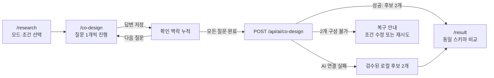

# 전공진화소 멘토링 반영 MVP 제작 명세서

- 문서 버전: 0.1
- 기준일: 2026-07-26
- 대상 브랜치: `feat/mentoring-mvp-professor-data`
- 기준 저장소: `choihyungyu0/MajorEvolutionHomepage`

## 0. 문서 상태 표기

이 문서는 사용자에게 확인된 방향, 현재 브랜치에서 동작하는 구현, 아직 남은 제작 범위를 구분한다.

| 표기 | 의미 |
|---|---|
| `[확정]` | 사용자가 직접 확인한 제품 방향 |
| `[구현]` | 현재 저장소 코드에서 확인되는 동작 |
| `[계획]` | MVP 완료를 위해 추가할 동작 |
| `[확인 필요]` | 사용자 결정, 대학 허가, API 정책 또는 데이터 검증이 선행되어야 하는 항목 |

멘토링 영상에서 녹음되지 않은 사용자 답변은 추정하지 않는다. 전후 맥락과 선택지를 다시 제시해 사용자가 확인한 답만 이 문서의 `[확정]` 항목으로 승격한다.

---

## 1. 제품 목표

### 1.1 핵심 목표

`[확정]` 사용자가 처음에 아이디어 탐색 모드 1개를 고르고, AI의 질문에 한 번에 하나씩 답하면서 자신의 연구 맥락을 구체화하도록 돕는다. 충분한 맥락이 모이면 숫자 점수나 단일 정답 대신, 서로 다른 전략의 연구 아이디어 **정확히 2개**를 동일한 항목으로 비교한다.

핵심 경험은 다음과 같다.

1. 사용자가 세 가지 탐색 모드 중 하나를 선택한다.
2. 전공, 관심 분야, 경험, 가능한 방법, 기간, 데이터 접근 조건을 입력한다.
3. AI가 한 번에 한 질문만 제시한다.
4. 사용자가 답할 때마다 `사용자 확인` 맥락으로 누적한다.
5. AI 제안과 아직 확인되지 않은 사실을 `사용자 확인`과 분리한다.
6. 대화가 끝나면 `안전 축소형`과 `차별 심화형` 후보를 정확히 2개 만든다.
7. 두 후보를 같은 스키마의 표로 비교하고, 사용자가 하나를 선택한다.

### 1.2 탐색 모드

| 모드 ID | 사용자 노출명 | 목적 | 근거 처리 |
|---|---|---|---|
| `free` | 자유 브레인스토밍 | 해당 학과 안에서 문제와 연구질문을 자유롭게 좁힘 | 사용자 확인 맥락을 우선 사용하며, 외부 사실을 임의로 추가하지 않음 |
| `trend` | 학과 × AI 트렌드 | 해당 학과의 공식 연구·논문과 AI 융합 흐름을 비교해 아이디어를 구체화 | 공식 교수 프로필과 그 프로필에 노출된 논문만 근거로 사용 |
| `fusion` | 전공 융합 | 사용자 전공과 다른 전공을 결합한 연구 아이디어를 구체화 | 두 전공의 공식 연구 근거를 분리해 제시하고, 연결 논리는 AI 제안으로 표시 |

`trend`와 `fusion` 모드에서 공식 근거 묶음이 준비되지 않았으면 최신 트렌드, 특정 교수 연구, 실제 논문을 사실처럼 생성하지 않는다. 해당 내용은 `확인 필요`로 남긴다.

### 1.3 교수·논문 데이터 목표

`[확정]` 1차 데이터 아키텍처의 대상은 단국대학교와 충북대학교의 **전 학과 전체**다.

- 대학 공식 페이지에서 교수 이름, 소속, 직위, 연구분야를 수집한다.
- 논문은 교수의 대학 공식 프로필에 노출된 목록만 최초 목록(seed)으로 수집한다.
- DOI/Crossref 또는 KCI 공개 메타데이터는 공식 프로필 목록에 이미 포함된 논문의 메타데이터를 보강하는 데만 사용한다.
- DOI/KCI 검색 결과만으로 새 논문을 추가하지 않는다.
- 공식 프로필에 연구분야 또는 논문 목록이 없으면 “없음”으로 단정하지 않고 `NOT_LISTED_ON_OFFICIAL_PROFILE`로 기록한다.
- 이메일과 전화·팩스는 수집 결과와 영속 캐시에 저장하지 않는다.
- 프로필 사진은 핵심 데이터·캐시에서 제외한다. 별도 사진 참조 장부에는 공식 사진 URL·출처·확인일만 기록하며, 파일 다운로드와 앱 표시는 이용 허가 확인 전까지 금지한다.

전 학과 전체는 목표 범위이지 현재 수집 완료를 의미하지 않는다. 특히 충북대학교 중앙 호스트의 robots 정책으로 자동 수집할 수 없는 범위는 우회하지 않고 `ROBOTS_BLOCKED` 또는 범위 `PARTIAL`로 명시한다.

---

## 2. 비목표

이번 MVP에서는 다음을 제공하지 않는다.

- 연구 아이디어의 실현성, 독창성, 합격 가능성을 0~100 숫자 점수로 평가
- 교수의 지도, 모집, 면담 가능 여부 추정 또는 보장
- 대학 공식 프로필에 없는 논문을 DOI/KCI 검색만으로 교수 실적으로 추가
- robots 정책 우회, 로그인 우회, 비공개 페이지 수집
- 이메일, 전화번호, 사진을 이용한 교수 연락처 데이터베이스
- 연구 결과, 인과관계, 논문 존재 여부를 AI가 근거 없이 생성
- 두 후보 중 자동으로 1등을 정하거나 사용자의 최종 선택을 대신함
- 전 학과 데이터를 확보한 것처럼 보이는 데모 레코드 생성
- 기존 전체 서비스의 모든 레거시 경로를 이번 브랜치에서 제거

`[확인 필요]` 새로고침 이후 공동설계 세션을 복구할지는 아직 확정되지 않았다. 현재 구현은 Zustand 메모리 상태를 사용하므로 새로고침 시 입력이 사라질 수 있다.

---

## 3. 현재 구현과 목표 범위

| 기능 | 현재 상태 | MVP 완료 조건 |
|---|---|---|
| 3개 탐색 모드 선택 | `[구현]` `/research`에 구현 | 모드별 문구와 질문 세트 QA |
| 조건 입력 | `[구현]` 전공, 관심, 경험, 방법, 기간, 데이터 접근, 회피 조건 | 전 학과 데이터와 연결 가능한 전공 식별자로 확장 |
| 한 번에 한 질문 | `[구현]` `/co-design`에 모드별 5문항 구현 | 키보드·모바일·스크린리더 흐름 검증 |
| 확인 맥락 누적 | `[구현]` 답변을 `사용자 확인`으로 저장하고 옆 패널에 표시 | 답변 수정 시 이후 맥락 무효화 정책 추가 `[확인 필요]` |
| 후보 2개 AI 생성 | `[구현]` `POST /api/ai/co-design`가 엄격 JSON 스키마로 정확히 2개와 고정 variant를 검증 | 공식 근거 묶음 연결 |
| AI 실패 시 대체 후보 | `[구현]` 검수된 로컬 후보로 폴백하며 컴퓨터공학도 비교쌍 2개를 구성 | 후보가 소진된 조건의 복구 안내 회귀 테스트 |
| 동일 비교표 | `[구현]` `/result`의 HTML `<table>`이 `problem`, `userConfirmed`, `aiProposed`를 포함한 동일 행으로 두 후보를 비교 | 접근성·모바일 표 탐색 QA |
| 숫자 점수 제거 | `[구현]` 공동설계 경로의 API·UI에 0~100 점수 없음 | 회귀 테스트로 점수 필드·문구 유입 방지 |
| 교수 연결 | `[구현 일부]` 가상 교수는 결과에서 숨기고 미연결 안내 표시 | 공식 데이터셋만 이용한 교수 연결 |
| 교수 데이터 스키마·수집기 | `[구현 일부]` 스키마, robots 준수 수집 파이프라인, 제한 샘플 존재 | 두 대학 허용 범위 수집, manifest·검증 보고 |
| 단국대 전 학과 | `[계획]` 공식 학과 발견 구조를 기반으로 확장 | 전체 발견 범위와 누락 사유를 manifest로 확인 |
| 충북대 전 학과 | `[확인 필요]` 중앙 robots 차단으로 자동 완주 불가 | 공식 허가, 허용 API 또는 검토된 학과별 공식 호스트 목록 확보 |
| DOI 보강 | `[구현 일부]` Crossref 보강 경로 존재 | 오매칭 검수 기준과 재현 가능한 결과 보고 |
| KCI 보강 | `[확인 필요]` API 키, 이용 조건, 호출 제한 확인 필요 | 발급 키와 정책 확인 후 공식 목록 seed에만 적용 |

현재 `data/research-mvp.ts`의 선택 가능한 전공은 수학, 식품자원경제학, 통계학, 컴퓨터공학, 경제학 5개다. 이는 전 학과 목표를 충족하지 않는다. 전 학과 데이터가 준비되면 표시명과 별도로 안정적인 `departmentId`를 사용해야 한다.

---

## 4. 화면과 라우트

### 4.1 사용자 흐름



### 4.2 `/research` — 탐색 모드와 기본 조건

`[구현]`

- 탐색 모드 1개 필수 선택: `free`, `trend`, `fusion`
- 학과·전공 필수
- 관심 연구 분야 1~3개
- 관련 경험 수준 1개
- 사용할 수 있는 방법·도구 1~2개
- 준비 가능 기간 1개
- 데이터 접근 상황 1개
- 피하고 싶은 방식 선택
- 필수 입력이 누락되면 첫 오류 항목으로 이동
- CTA: `AI와 공동설계 시작하기`

`[계획]`

- 대학과 학과 선택을 `universityId`, `departmentId`, 표시명으로 분리한다.
- `fusion` 모드에서는 결합할 다른 전공을 조건 화면 또는 첫 질문에서 명시적으로 선택한다.
- `trend`·`fusion` 모드 진입 전에 해당 학과의 공식 근거 가용 상태를 보여준다.

### 4.3 `/co-design` — 한 번에 한 질문

`[구현]`

- 진행률: 현재 질문 / 전체 5문항
- 모드별 첫 질문 1개 + 공통 질문 4개
- 선택지 또는 최대 160자 직접 입력
- 답변 완료 시 `status: "사용자 확인"`으로 저장
- 이전 질문 이동
- 오른쪽 맥락 패널에 기본 조건과 완료 답변 누적 표시
- 상태 범례: `사용자 확인`, `AI 제안`, `확인 필요`
- 마지막 질문 제출 후 후보 생성

공통 질문 축은 핵심 문제, 확인 가능한 자료, 우선 방법, 목표 결과물이다. 모드별 첫 질문은 자유 탐색의 대상, AI 트렌드 탐색 초점, 융합할 전공 중 하나를 묻는다.

`[계획]`

- 과거 답변을 수정하면 그 답을 전제로 생성된 후속 답변을 유지할지 다시 확인한다.
- 공식 근거 묶음이 있으면 출처 제목, 공식 URL, 수집 상태와 확인일을 펼쳐 볼 수 있게 한다.
- 근거가 차단되거나 미기재된 경우 질문 문구가 이를 사실로 전제하지 않도록 한다.

### 4.4 `/result` — 두 아이디어 비교

`[구현]`

- AI 생성인지 검수된 로컬 폴백인지 배너로 표시
- 선택한 모드와 사용자 확인 답변 요약
- 후보 A `안전 축소형`, 후보 B `차별 심화형`
- `problem`, `userConfirmed`, `aiProposed`를 보존해 두 후보를 같은 행의 HTML 표로 표시
- 개별 후보 카드와 후보 선택
- 공식 교수 데이터가 없으면 미연결·robots 차단 가능성을 명시

`[계획]`

- 교수 연결은 공식 데이터셋에서 상태가 검증된 레코드만 사용한다.
- 후보별 근거가 `사용자 확인`, `공식 프로필`, `공식 논문 목록`, `확인 필요` 중 무엇인지 출처 단위로 표시한다.

---

## 5. 상태 전이

### 5.1 공동설계 세션 상태

| 상태 | 진입 조건 | 허용 행동 | 다음 상태 |
|---|---|---|---|
| `SETUP` | `/research` 진입 | 모드·조건 입력 | `QUESTIONING` |
| `QUESTIONING` | 필수 조건 완료 | 현재 질문 답변, 이전 질문 이동 | `QUESTIONING`, `GENERATING` |
| `GENERATING` | 마지막 답변 저장 | 중복 제출 방지, API 대기 | `RESULT_READY`, `FALLBACK`, `RECOVERABLE_ERROR` |
| `FALLBACK` | AI 연결 실패 | 검수된 로컬 후보 2개 구성 | `RESULT_READY`, `RECOVERABLE_ERROR` |
| `RESULT_READY` | 동일 스키마 후보 2개 확보 | 비교, 후보 선택, 다시 추천 | `SELECTED`, `GENERATING` |
| `SELECTED` | 사용자가 후보 하나 선택 | 선택 유지, 다음 실행 단계 이동 `[확인 필요]` | `[확인 필요]` |
| `RECOVERABLE_ERROR` | 후보 2개 구성 불가 | 조건 수정, 재시도 | `SETUP`, `GENERATING` |

다음 불변 조건을 지켜야 한다.

- `QUESTIONING`에서는 화면에 질문을 한 개만 노출한다.
- 답변은 공백이 아닌 값만 저장한다.
- 동일 `questionId`의 답변은 하나만 존재한다.
- 후보 비교 화면은 후보가 정확히 2개일 때만 렌더링한다.
- 후보 1개만 반환된 상태를 성공으로 처리하지 않는다.
- 결과 API와 상태 저장소에는 숫자 점수 필드를 두지 않는다.

### 5.2 답변 상태

```ts
type ConfirmedAnswer = {
  questionId: string;
  label: string;
  value: string;        // 최대 160자
  status: "사용자 확인";
};
```

AI가 해석하거나 확장한 내용은 원 답변을 덮어쓰지 않고 별도의 `aiProposed` 배열에 둔다. 외부 검증이 필요한 주장은 `확인 필요` 근거를 연결한다.

---

## 6. 두 후보의 동일 비교 스키마

후보 A와 B는 동일한 필드를 모두 가져야 하며, 값이 없으면 필드를 생략하지 않고 `확인 필요`로 표시한다.

| 필드 | 타입 | 비교표 행 | 규칙 |
|---|---|---|---|
| `variant` | enum | 후보 유형 | A는 `안전 축소형`, B는 `차별 심화형` |
| `title` | string | 주제명 | 한 문장, 서로 중복 금지 |
| `problem` | string | 해결할 문제 | 대상과 문제 상황을 구체화 |
| `question` | string | 연구질문 | 검증 가능한 질문 형태 |
| `reason` | string | 내 조건과 연결 | 사용자 확인 맥락을 근거로 설명 |
| `userConfirmed` | string[] | 사용자 확인 | 실제 답변에서만 추출 |
| `aiProposed` | string[] | AI 제안 | 사실이 아니라 제안임을 명시 |
| `dataOptions` | object[] | 데이터 후보 | 각 항목에 `확인됨/조건부/확인 필요` 상태 |
| `methodDetail` | string | 방법 | 가능한 분석·조사 방법 |
| `scope` | string | 기간·예상 범위 | 선택한 기간에 맞는 최소 범위 |
| `uncertainties` | string[] | 확인할 점 | 교수·데이터·윤리·방법 위험 |
| `firstAction` | string | 첫 30분 행동 | 즉시 실행 가능한 한 가지 행동 |
| `evidence` | object[] | 근거 상태 | 출처 유형, ID, 상태, 확인일 |

후보 생성 응답의 기준 타입은 다음과 같다.

```ts
type CheckStatus = "확인됨" | "조건부" | "확인 필요";

type Evidence = {
  title: string;
  type: "사용자 확인" | "공식 프로필" | "공식 논문 목록" | "확인 필요";
  status: CheckStatus;
  sourceId: string;
  verifiedAt: string;
};

type Candidate = {
  variant: "안전 축소형" | "차별 심화형";
  title: string;
  problem: string;
  question: string;
  reason: string;
  userConfirmed: string[];
  aiProposed: string[];
  dataOptions: { name: string; status: CheckStatus }[];
  methodDetail: string;
  scope: string;
  uncertainties: string[];
  firstAction: string;
  evidence: Evidence[];
};
```

`[구현]` API의 `problem`, `userConfirmed`, `aiProposed`는 `ResearchTopic` 변환 과정에서 보존되며 `/result`의 동일 스키마 HTML 표에 직접 표시된다. 서버는 `userConfirmed`의 각 항목을 실제 `answer.value` 집합과 대조하고, 일치한 원문 값만 결과에 남긴다.

---

## 7. 교수·논문 데이터 계약

### 7.1 데이터셋 루트

```ts
type ProfessorDataset = {
  schema_version: "1.0.0";
  generated_at: string; // ISO 8601
  publication_scope: "OFFICIAL_PROFILE_LIST_ONLY";
  records: ProfessorRecord[];
};
```

### 7.2 교수 레코드

```ts
type CollectionStatus =
  | "FOUND"
  | "NOT_LISTED_ON_OFFICIAL_PROFILE"
  | "PROFILE_UNAVAILABLE"
  | "PARSE_FAILED"
  | "ROBOTS_BLOCKED";

type ProfessorRecord = {
  schema_version: "1.0.0";
  id: string;                         // 안정적 비식별 ID
  university: "단국대학교" | "충북대학교";
  college: string;
  department: string;
  name: string | null;
  title: string | null;
  research_fields: string[];
  publications: PublicationRecord[];
  official_profile_url: string | null;
  source_url: string;
  collected_at: string;
  status: CollectionStatus;
  research_fields_status: CollectionStatus;
  publications_status: CollectionStatus;
  failure_reason: string | null;
  content_hash: string | null;
};
```

연구분야와 논문 목록은 서로 다른 상태를 가진다. 연구분야는 공개됐지만 논문 목록은 미기재된 경우를 하나의 `status`로 뭉개지 않는다.

### 7.3 논문 레코드

```ts
type PublicationRecord = {
  title: string;
  publication_type: string | null;
  published_date: string | null;
  doi: string | null;
  kci_id: string | null;
  official_profile_url: string | null;
  metadata_source: string;
};
```

논문 처리 규칙:

1. 공식 교수 프로필에 제목이 노출된 항목만 seed로 생성한다.
2. Crossref DOI 또는 KCI 메타데이터는 제목, 저자, 연도 등으로 seed와 일치가 확인된 경우에만 기존 레코드를 보강한다.
3. API 검색 결과의 미일치 항목은 `publications`에 추가하지 않는다.
4. 불확실한 매칭은 원 값을 유지하고 검수 보고서에 남긴다.
5. `[확인 필요]` DOI/KCI 자동 매칭 임계값과 동명이인 검수 기준.

### 7.4 상태 enum 의미

| 상태 | 의미 | UI 문구 원칙 |
|---|---|---|
| `FOUND` | 공식 프로필에서 해당 정보를 확인 | 공식 출처와 확인일 표시 |
| `NOT_LISTED_ON_OFFICIAL_PROFILE` | 프로필은 있으나 연구분야 또는 논문 목록이 노출되지 않음 | “공식 프로필 미기재”; “논문 없음”으로 표현 금지 |
| `PROFILE_UNAVAILABLE` | 공식 상세 프로필 URL이 없거나 사용할 수 없음 | “공식 프로필 확인 불가” |
| `PARSE_FAILED` | 페이지는 받았지만 구조를 안전하게 해석하지 못함 | “수집 구조 확인 필요”와 실패 사유 |
| `ROBOTS_BLOCKED` | robots 정책 때문에 요청하지 않음 | “robots 정책으로 자동 수집하지 않음” |

데이터셋 전체의 범위 상태는 manifest에서 `COMPLETE`, `PARTIAL`, `BLOCKED`로 별도 관리한다. `[확인 필요]` 이 범위 enum은 현재 JSON Schema에 포함되지 않았으므로 manifest 계약으로 확정할지 검토가 필요하다.

### 7.5 금지 데이터

다음 필드는 원본 페이지에 공개되어 있어도 핵심 데이터 JSON, 캐시, 로그, 프롬프트에 저장하지 않는다.

- 이메일 주소
- 전화·팩스 번호
- 프로필 사진 이미지 URL·바이너리. 단, 핵심 데이터와 분리된 `photo-references` 장부에는 공식 URL·출처·확인일만 허용
- 개인 소셜 계정
- 공식 연구 근거와 무관한 개인정보

검증기는 금지 키뿐 아니라 값 안의 이메일, 전화번호, 이미지 URL 패턴도 검사한다. 사진 참조 장부는 사진 바이너리를 저장하지 않고 `REFERENCE_ONLY_PERMISSION_UNVERIFIED` 상태를 유지하는 별도 계약을 사용한다.

### 7.6 출처·수집 provenance

최소 필드는 현재 스키마의 `source_url`, `official_profile_url`, `collected_at`, `content_hash`, 상태와 실패 사유다.

`[계획]` 재현성과 사이트 변경 감지를 위해 manifest에 다음을 유지한다.

- 최종 호스트와 URL
- robots URL, 확인 시각, 판정 결과
- HTTP `ETag`, `Last-Modified`
- 원문 SHA-256
- 파서 버전
- 최초·최근 확인일
- 메타데이터 보강 출처
- DOI/KCI 매칭 방식과 신뢰 수준

---

## 8. API 계약

### 8.1 `POST /api/ai/co-design`

`[구현]` 공동설계 답변으로 후보 2개를 생성한다. 응답은 캐시하지 않는다.

#### 요청

```json
{
  "mode": "trend",
  "conditions": {
    "major": "통계학",
    "interests": ["AI·머신러닝", "데이터 분석"],
    "experience": "관련 수업 수강",
    "methods": ["데이터 분석"],
    "period": "8주",
    "dataAccess": "공개 데이터",
    "avoid": []
  },
  "answers": [
    {
      "questionId": "trend-focus",
      "label": "트렌드 탐색 초점",
      "value": "새로운 데이터 활용",
      "status": "사용자 확인"
    }
  ]
}
```

요청 규칙:

- `mode`: `free | trend | fusion`
- 필수 조건은 모두 채워져야 한다.
- UI 완료 요청에는 현재 모드의 5개 질문 답변이 모두 있어야 한다.
- 답변 값은 최대 160자다.
- 서버는 클라이언트가 보낸 `status`를 신뢰하지 않고 `사용자 확인`으로 정규화한다.
- `[구현]` 서버는 `questionsForMode(mode)`의 기대 `questionId` 5개와 요청 답변의 개수·ID를 대조한다. 누락되거나 다른 ID가 섞이면 400 오류로 거부한다.

#### 성공 응답

```json
{
  "candidates": [
    {
      "variant": "안전 축소형",
      "title": "...",
      "problem": "...",
      "question": "...",
      "reason": "...",
      "userConfirmed": ["..."],
      "aiProposed": ["..."],
      "dataOptions": [{ "name": "...", "status": "확인 필요" }],
      "methodDetail": "...",
      "scope": "...",
      "uncertainties": ["..."],
      "firstAction": "...",
      "evidence": [
        {
          "title": "...",
          "type": "사용자 확인",
          "status": "확인됨",
          "sourceId": "trend-focus",
          "verifiedAt": "현재 세션"
        }
      ]
    },
    {
      "variant": "차별 심화형",
      "title": "...",
      "problem": "...",
      "question": "...",
      "reason": "...",
      "userConfirmed": ["..."],
      "aiProposed": ["..."],
      "dataOptions": [{ "name": "...", "status": "확인 필요" }],
      "methodDetail": "...",
      "scope": "...",
      "uncertainties": ["..."],
      "firstAction": "...",
      "evidence": [
        {
          "title": "...",
          "type": "확인 필요",
          "status": "확인 필요",
          "sourceId": "needs-check",
          "verifiedAt": "확인 필요"
        }
      ]
    }
  ],
  "generatedAt": "2026-07-26T00:00:00.000Z",
  "model": "...",
  "grounding": {
    "officialSourceCount": 0,
    "blockedSourceCount": 0,
    "note": "..."
  }
}
```

성공 불변 조건:

- `candidates.length === 2`
- 첫 후보는 `안전 축소형`, 두 번째 후보는 `차별 심화형`
- 두 후보의 필드 집합이 동일
- 점수, 순위, 합격 가능성 필드 없음
- `evidence.sourceId`는 요청 답변 ID, 제공된 공식 근거 ID 또는 `needs-check` 중 하나
- `userConfirmed`는 서버가 실제 요청의 `answer.value`와 대조한 원문 값만 포함
- 공식 근거 묶음에 없는 논문·교수·트렌드를 생성하지 않음

`[구현 차이]` 현재 `officialSourceCount`와 `blockedSourceCount`는 0으로 고정되고 공식 근거 묶음은 비어 있다. 데이터 연결 후 서버가 허용된 공식 근거 ID 목록을 구성해야 한다.

#### 오류

| HTTP | 코드 예시 | 처리 |
|---|---|---|
| 400 | `invalid_request`, `invalid_output` | 누락 조건·답변을 표시하고 입력 화면으로 복구 |
| 429 | `rate_limited` | 잠시 후 재시도 안내 |
| 502 | `upstream`, `invalid_output` | 검수된 로컬 후보 2개 폴백 시도 |
| 503 | `upstream` | AI 설정 불가 안내 후 폴백 |
| 504 | `timeout` | 재시도 또는 폴백 |

폴백도 동일 비교 스키마와 정확히 2개 조건을 만족해야 한다. 만족하지 못하면 비교표를 그리지 않고 `RECOVERABLE_ERROR`로 전환한다.

### 8.2 교수 데이터 조회

`[계획]` 앱은 수집 원본을 브라우저에 직접 노출하지 않고, 검증된 데이터셋을 서버 전용 로더로 읽는다. 공개 API가 필요하면 다음 최소 계약을 사용한다.

```http
GET /api/professors?university=dku&departmentId={id}&status=FOUND
```

응답에는 금지 개인정보를 제외한 교수 레코드, 공식 프로필 URL, 세부 상태, 수집일만 포함한다. 원본 HTML, 캐시 경로, API 키는 반환하지 않는다.

`[확인 필요]` 이 조회를 공개 API로 제공할지, Next.js 서버 컴포넌트 내부 로더로만 사용할지 결정해야 한다.

---

## 9. 수락 기준

### 9.1 공동설계 UX

- [ ] 사용자는 `/research`에서 세 모드 중 정확히 하나를 선택할 수 있다.
- [ ] 필수 조건을 모두 입력하지 않으면 `/co-design`으로 이동하지 않는다.
- [ ] `/co-design`은 어느 시점에도 주 질문을 한 개만 보여준다.
- [ ] 모드별 첫 질문과 공통 네 질문, 총 5개에 답할 수 있다.
- [ ] 완료 답변은 화면 옆의 확인 맥락에 즉시 누적된다.
- [ ] 누적 답변은 `사용자 확인`으로 표시되고 AI 제안과 섞이지 않는다.
- [ ] 빈 답변은 저장되지 않으며 직접 입력은 160자를 넘지 않는다.
- [ ] 데스크톱과 390px 모바일에서 질문, 선택지, CTA가 잘리지 않는다.

### 9.2 후보 생성·비교

- [x] 성공 결과는 항상 후보 정확히 2개다.
- [x] A는 `안전 축소형`, B는 `차별 심화형`이다.
- [x] 후보 두 개가 6절의 동일 비교 스키마를 모두 가진다.
- [x] HTML 비교표는 같은 행에서 두 후보의 같은 필드를 보여준다.
- [x] `problem`, `userConfirmed`, `aiProposed`가 변환 과정에서 소실되지 않는다.
- [x] `userConfirmed`는 실제 사용자 `answer.value`로만 서버에서 정규화된다.
- [x] UI, API, 저장 상태에 0~100 실현성 점수나 자동 순위가 없다.
- [x] AI 실패 시 폴백도 2개를 반환하거나 명시적 복구 화면을 보여준다. 컴퓨터공학 비교쌍도 포함한다.
- [x] 사용자는 두 후보 중 하나를 직접 선택할 수 있다.

### 9.3 근거 무결성

- [ ] 사용자 답변 ID가 아닌 근거를 `사용자 확인`으로 표시하지 않는다.
- [ ] 공식 근거 묶음에 없는 교수, 논문, 최신 트렌드를 사실처럼 표시하지 않는다.
- [ ] 미검증 내용은 `확인 필요`로 표시한다.
- [ ] 근거 출처 URL과 최근 확인일을 확인할 수 있다.
- [ ] 교수 모집·지도·면담 가능 여부 미확인 고지가 항상 노출된다.

### 9.4 교수 데이터

- [ ] 데이터셋은 `publication_scope: OFFICIAL_PROFILE_LIST_ONLY`다.
- [ ] DOI/KCI 보강 전후 논문 seed 개수가 임의로 늘지 않는다.
- [ ] 모든 교수 레코드에 레코드·연구분야·논문 상태가 각각 존재한다.
- [ ] 프로필에 목록이 없으면 `NOT_LISTED_ON_OFFICIAL_PROFILE`로 기록한다.
- [ ] robots 차단 URL을 요청하지 않고 `ROBOTS_BLOCKED`로 기록한다.
- [ ] 충북대 전 학과 미완료 범위를 `PARTIAL` 또는 `BLOCKED`로 보고한다.
- [ ] 이메일과 전화·팩스가 JSON·캐시·로그에 없다.
- [ ] 사진 URL은 별도 참조 장부에만 있고 사진 바이너리와 앱 표시는 없다.
- [ ] schema 검증, SHA-256, 수집 manifest, 사람이 읽는 보고서가 함께 생성된다.
- [ ] “전 학과 완료” 주장은 대학별 발견 학과 수와 처리 상태가 검증된 뒤에만 사용한다.

---

## 10. 테스트 명세

### 10.1 단위 테스트

- `questionsForMode(mode)`가 각 모드에서 5개 질문을 반환한다.
- 모드 변경 시 이전 공동설계 답변과 결과가 초기화된다.
- 같은 `questionId`에 다시 답하면 중복 없이 값이 교체된다.
- 공백 답변과 160자 초과 입력을 거부·절단한다.
- 후보 응답 스키마가 정확히 2개와 고정 variant 순서를 검증한다.
- 후보 A/B의 키 집합이 동일한지 검증한다.
- `evidence.sourceId` 허용 목록 밖의 값은 서버가 거부한다.
- 결과 타입에 `score`, `rank`, `feasibilityScore`가 없음을 검증한다.
- AI 실패 폴백이 2개 미만이면 성공 상태를 만들지 않는다.

### 10.2 통합 테스트

- `/research → /co-design → /result` 정상 경로
- 세 모드 각각의 질문 완료와 요청 payload
- 이전 질문 수정 후 맥락과 최종 요청 일치
- AI 성공 응답과 근거 상태 렌더링
- 400, 429, 502, 503, 504 처리와 폴백·복구 분기
- 새로고침·직접 URL 접근 시 `/research` 복귀
- 결과에서 사용자 확인 맥락, AI 제안, 확인 필요 항목 분리

### 10.3 E2E·접근성 테스트

- 1536×1024 데스크톱, 390×844 모바일
- 키보드만으로 모드, 선택지, 이전·다음, 후보 선택 가능
- radiogroup·radio, 진행률, 오류 `role="alert"` 읽기 순서
- 긴 한국어 직접 입력과 긴 학과명이 레이아웃을 깨지 않음
- API 대기 중 중복 제출 차단
- 색상만으로 상태를 구분하지 않고 아이콘·텍스트 병행

### 10.4 수집기·데이터 QA

- 고정 fixture로 DKU·CBNU 파서 회귀 테스트
- 매 요청 전 최종 URL 호스트의 robots 판정 테스트
- 리디렉션 시 새 호스트 robots 재평가
- 429/5xx 재시도, 타임아웃, 호스트별 간격 테스트
- JSON Schema 검증과 금지 개인정보 패턴 검사
- 동일 교수·논문 중복 제거와 안정 ID 재현성
- DOI/KCI 보강이 seed 논문 수를 증가시키지 않는지 검사
- `PARSE_FAILED` fixture를 추가해 원인·해결·예방 정보를 report에 남김

---

## 11. 위험과 대응

| 위험 | 영향 | 대응 |
|---|---|---|
| 충북대 중앙 robots 전체 차단 | 전 학과 자동 발견 불가 | 우회 금지, 허용된 학과별 호스트만 수집, 대학 허가·공식 API·검토 시드 확보 |
| 대학 사이트 구조 변경 | 파싱 실패·누락 | `PARSE_FAILED`, 콘텐츠 해시, 파서 버전, fixture 회귀 테스트 |
| 공식 프로필 정보 미기재 | 연구·논문이 없는 것으로 오해 | `NOT_LISTED_ON_OFFICIAL_PROFILE`와 안내 문구 사용 |
| DOI/KCI 동명이인·유사 제목 오매칭 | 잘못된 논문 메타데이터 | seed 제한, 보수적 매칭, 매칭 근거·신뢰 수준 기록, 불확실하면 보강 안 함 |
| LLM 환각 | 존재하지 않는 교수·논문·트렌드 생성 | 허용 source ID 검증, 공식 근거 없으면 `확인 필요`, 엄격 JSON Schema |
| 크롤링 문서의 프롬프트 주입 | AI 지시 오염 | 공식 문서를 데이터로만 직렬화하고 명령문 무시, 필드 길이·형식 제한 |
| AI 키·서비스 장애 | 후보 생성 중단 | 검수된 로컬 후보 2개 폴백, 실패 상태와 원인 노출 |
| 전공 5개 하드코딩 | 전 학과 UX와 불일치 | 안정 `departmentId` 기반 데이터 선택기로 교체 |
| 결과 필드 회귀 손실 | 비교표의 근거 분리 약화 | `[구현]` `problem`, `userConfirmed`, `aiProposed` 보존·표시; 타입·렌더링 회귀 테스트 추가 |
| 세션 메모리만 사용 | 새로고침 시 답변 손실 | `[확인 필요]` 세션 저장소 복구 또는 명확한 경고 |
| 로컬 폴백의 후보 부족 | 정확히 2개 요구 위반 | 후보 1개 화면 금지, 조건 수정·재시도 상태로 전환 |

---

## 12. 후속 작업 우선순위

### P0 — 현재 MVP 경로 완결

- [x] `problem`, `userConfirmed`, `aiProposed`를 결과 타입과 동일 비교표까지 보존한다.
- [x] `userConfirmed`를 실제 사용자 답변 원문으로만 서버에서 정규화한다.
- [x] 공동설계 API에서 모드별 기대 질문 5개를 검증한다.
- [x] 성공 결과를 후보 2개로 제한하고 컴퓨터공학 로컬 폴백에도 비교쌍 2개를 제공한다.
- [x] 결과를 동일 스키마의 HTML `<table>`로 구현한다.
- [ ] 공동설계 경로의 단위·통합·모바일 E2E 테스트를 추가한다.
- [ ] 후보가 필터·재추천으로 소진되는 경계 조건에서 복구 상태를 회귀 테스트한다.
- [x] 레거시 점수 화면의 직접 라우트를 `/research`로 이동시키고, 최신 공동설계 MVP와 진입 경로를 분리한다.

### P1 — 공식 교수 데이터 연결

1. 단국대학교 발견 가능 전체 학과 수집 결과와 누락 상태를 manifest로 확정한다.
2. 충북대학교 허용 학과 호스트 시드를 검토하고, 차단 범위를 별도 보고한다.
3. 검증된 교수 데이터 서버 로더를 만들고 결과 화면에 연결한다.
4. 논문 seed 불변 테스트 후 Crossref DOI를 보강한다.
5. `[확인 필요]` KCI 키·정책·호출 제한을 확인한 뒤 보강기를 활성화한다.

### P2 — 근거 기반 트렌드·융합 고도화

1. 공식 교수 연구분야와 공식 프로필 논문 목록을 학과별 근거 묶음으로 구성한다.
2. 근거 ID를 공동설계 API의 허용 목록에 넣는다.
3. `trend` 모드에 “우리 학과의 공식 연구 흐름 vs AI 융합 제안”을 분리 표시한다.
4. `fusion` 모드에 두 전공 각각의 공식 근거와 AI 연결 가설을 분리 표시한다.
5. 출처 확인일, 미기재, robots 차단, 파싱 실패를 사용자 화면에서도 확인할 수 있게 한다.

---

## 13. 남은 확인 사항

- `[확인 필요]` 멘토링 영상에서 녹음되지 않은 답변 중 제품 범위를 바꾸는 결정. 전후 질문 장면과 가능한 선택지를 다시 제시한 뒤 확정한다.
- `[확인 필요]` 새로고침·재방문 시 공동설계 답변을 브라우저 세션에 복구할지 여부.
- `[확인 필요]` 답변 수정 시 이후 답변을 유지할지 초기화할지 여부.
- `[확인 필요]` 후보 하나를 선택한 뒤 제공할 다음 단계: 교수 면담 질문, 연구계획서 초안, 저장·공유 중 어디까지를 MVP에 포함할지.
- `[확인 필요]` 충북대학교 전 학과 수집을 위한 대학 허가, 공식 API 또는 검토된 학과별 호스트 목록 확보 가능 여부.
- `[확인 필요]` KCI Open API 키와 이용·재배포 조건.
- `[확인 필요]` 공식 교수 데이터 조회를 공개 API로 제공할지 서버 내부 로더로 제한할지.

확인되지 않은 항목은 기본 경로에 임의로 반영하지 않는다. 현재 확정된 하이브리드 C 흐름과 공개 근거·상태 표시 원칙을 우선 구현한다.
