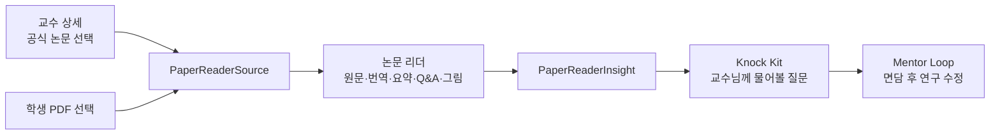

# 논문 리더 통합 기획서·기능명세서

기준일: 2026-07-28
문서 상태: 팀원 구현 전달용
통합 방식: 별도 사이트 링크가 아닌 현재 Next.js 저장소에 소스 병합

## 1. 목표

교수 상세에 있는 논문이나 학생이 가진 PDF를 읽고, 분석 결과를 교수 면담 준비에 바로 사용하는 작업공간을 만든다.

완료 화면은 다음 다섯 기능을 한 문서 맥락 안에서 제공해야 한다.

1. PDF 원문
2. 전체 한국어 번역
3. 쉬운 구조화 요약
4. 논문 기반 질의응답
5. 표·그림 해설

## 2. 현재 준비된 통합 경계

| 항목 | 위치 | 설명 |
|---|---|---|
| 통합 라우트 | `app/paper/reader/page.tsx` | 최종 주소 `/paper/reader` 유지 |
| 교체 대상 | `components/paper-reader/paper-reader-shell.tsx` | 현재 안내 셸을 실제 리더로 교체 |
| 공통 계약 | `lib/paper-reader-contract.ts` | 입력·저장 결과 타입의 단일 기준 |
| 기존 분석 | `components/screens/paper-screen.tsx` | 초록·본문 붙여넣기 분석, 삭제 금지 |
| 기존 API | `app/api/ai/paper/route.ts` | 텍스트 구조화 분석, 호환 유지 |

현재 셸에는 가짜 업로드나 분석 버튼이 없다. 담당 개발자가 실제 PDF 처리와 오류 상태를 구현한 뒤 셸을 교체한다.

## 3. 서비스 내 위치



## 4. 기능 요구사항

### 4.1 PDF 입력과 원문

필수:

- PDF 파일 선택과 드래그앤드롭
- 파일 형식·크기·페이지 수 검증
- 페이지 이동, 확대·축소, 현재 페이지 표시
- 텍스트 PDF는 브라우저에서 텍스트 추출
- 스캔 PDF는 페이지별 OCR 실행과 진행률 표시
- 손상·암호화·빈 PDF를 서로 다른 오류로 안내
- 같은 문서를 다시 열 수 있는 브라우저 로컬 서재
- 문서 삭제 시 원문·추출 텍스트·AI 결과·대화·그림 해설까지 함께 삭제

완료 조건:

- 텍스트 PDF와 스캔 PDF 샘플을 각각 열 수 있다.
- 분석 실패 후에도 원문은 계속 볼 수 있다.
- 삭제 후 새로고침해도 해당 문서가 복구되지 않는다.

### 4.2 전체 번역

필수:

- 원문 페이지 또는 절과 번역을 같은 위치에서 전환
- 한 번에 전체 파일을 요청하지 않고 페이지·절 단위로 순차 번역
- 완료·진행 중·실패·재시도 상태
- 표 제목, 그림 캡션, 참고문헌을 일반 본문과 구분
- 번역 결과에 원문 페이지 번호 유지

완료 조건:

- 사용자가 읽고 있는 페이지의 번역을 우선 볼 수 있다.
- 일부 번역 실패가 이미 완료된 페이지를 지우지 않는다.
- 번역문만 보고도 원문 페이지로 돌아갈 수 있다.

### 4.3 쉬운 요약

필수 출력:

- 한 줄 요약
- 연구 배경
- 핵심 연구 질문
- 연구 방법
- 핵심 결과
- 한계와 해석 주의점
- 어려운 용어
- 교수 연구와 연결되는 이유

완료 조건:

- 결과마다 근거 페이지가 하나 이상 연결된다.
- 초록만 분석했는지 전체 본문을 분석했는지 표시한다.
- 근거가 부족한 항목은 추정해 채우지 않고 `확인 필요`로 표시한다.

### 4.4 논문 질의응답

필수:

- 현재 문서 안에서만 답변
- 답변마다 페이지·절 근거 표시
- 근거 페이지로 이동
- 근거가 없으면 모른다고 답변
- 질문·답변 기록 유지와 개별 삭제
- 추천 질문: `이 논문의 핵심 기여는?`, `교수님께 무엇을 물어볼까?`, `내 아이디어와 어떻게 연결할까?`

완료 조건:

- 문서 밖의 사실을 문서에 있는 것처럼 답하지 않는다.
- 페이지 근거를 누르면 실제 원문 위치가 열린다.
- 새 질문 중에도 원문 읽기와 이전 답변 확인이 가능하다.

### 4.5 그림·표 해설

필수:

- 현재 페이지에서 그림 또는 표 선택
- 그림 번호·캡션·축·범례 인식
- `무엇을 보여주는가 → 어떻게 읽는가 → 핵심 결론 → 주의점` 순서 설명
- 시각 정보가 불명확하면 사용자가 범위를 다시 선택할 수 있게 안내
- 해설에 원문 페이지와 캡션 연결

완료 조건:

- 선 그래프, 막대그래프, 표가 포함된 샘플에서 서로 다른 설명을 제공한다.
- 캡션과 실제 그림의 관계가 불확실하면 단정하지 않는다.
- 선택하지 않은 페이지의 그림을 설명하지 않는다.

## 5. 화면 구조

### 데스크톱

```text
┌───────────────────────────────────────────────────────────┐
│ 문서 제목 · 저장 상태 · 삭제                              │
├────────────────────────┬──────────────────────────────────┤
│ PDF 원문               │ 원문 | 전체 번역 | 쉬운 요약    │
│ 페이지·확대·선택       │ 질의응답 | 그림 해설            │
│                        │                                  │
├────────────────────────┴──────────────────────────────────┤
│ 면담 질문으로 저장 · Knock Kit로 이동                     │
└───────────────────────────────────────────────────────────┘
```

### 모바일

- PDF 원문과 분석 영역을 위아래로 억지 배치하지 않는다.
- 상단의 `원문 / 번역 / 요약 / Q&A / 그림` 탭으로 한 영역씩 전환한다.
- 하단에는 `면담 질문으로 저장` 하나를 주 행동으로 둔다.
- 390px에서 버튼·탭·긴 논문 제목이 가로로 넘치지 않아야 한다.

## 6. 공통 데이터 계약

구현 기준 파일은 `lib/paper-reader-contract.ts`다.

### 입력: `PaperReaderSource`

```ts
{
  paperId: string;
  title: string;
  authors: string[];
  publishedYear?: number;
  professorId?: string;
  professorName?: string;
  doi?: string;
  officialSourceUrl?: string;
}
```

### 출력: `PaperReaderInsight`

```ts
{
  schemaVersion: "1.0";
  paper: PaperReaderSource;
  summary: {
    oneLine: string;
    background: string;
    researchQuestion: string;
    methods: string[];
    findings: string[];
    limitations: string[];
  };
  professorBrief: {
    relevanceNote: string;
    keywords: string[];
    meetingQuestions: string[];
  };
  citations: Array<{
    page: number;
    section?: string;
    quote?: string;
  }>;
  generatedAt: string;
}
```

`onInsightSave(insight)`가 호출되면 전공진화소가 해당 값을 Knock Kit 저장소에 반영한다. 타입을 바꿔야 한다면 먼저 이 문서를 갱신하고 코어 담당자와 합의한다.

## 7. 권장 구현 구조

```text
components/paper-reader/
├─ paper-reader-workspace.tsx
├─ pdf-viewer.tsx
├─ reader-tabs.tsx
├─ translation-panel.tsx
├─ summary-panel.tsx
├─ qa-panel.tsx
├─ figure-panel.tsx
└─ document-library.tsx

lib/paper-reader/
├─ extract-text.ts
├─ ocr-page.ts
├─ chunk-document.ts
├─ local-library.ts
└─ validators.ts

app/api/ai/paper-reader/
├─ translate/route.ts
├─ summary/route.ts
├─ qa/route.ts
└─ figure/route.ts
```

원문 PDF 전체를 서버 API에 그대로 보내는 구조는 피한다. 브라우저에서 텍스트와 선택한 페이지 이미지를 추출한 뒤 분석에 필요한 범위만 전송한다.

같은 Next.js/Vercel 프로젝트에 병합하므로 별도 도메인이나 전통적인 서버 구매는 필수가 아니다. 다른 기기 간 서재 동기화가 필요해지는 시점에 인증·비공개 파일 저장소·DB를 후속 범위로 추가한다.

## 8. 상태와 오류 명세

| 상태 | 사용자 안내 | 복구 |
|---|---|---|
| 파일 형식 오류 | PDF만 지원 | 다른 파일 선택 |
| 파일 손상 | 문서를 열 수 없음 | 원본 확인 후 재선택 |
| 암호화 PDF | 비밀번호가 설정된 문서 | 잠금 해제본 선택 |
| 텍스트 없음 | 스캔 문서로 판단 | OCR 시작 |
| OCR 일부 실패 | 실패 페이지 번호 표시 | 해당 페이지만 재시도 |
| 번역 일부 실패 | 완료 페이지 유지 | 실패 절 재시도 |
| AI 응답 실패 | 원문과 기존 결과 유지 | 재요청 |
| 근거 없음 | 문서에서 확인되지 않음 | 질문 수정 |
| 저장 공간 부족 | 저장되지 않은 항목 표시 | 문서 삭제 후 재시도 |
| 오프라인 | 로컬 원문만 제공 | 연결 복구 후 분석 |

## 9. 개인정보·저작권 원칙

- 업로드 전에 처리 위치와 서버 전송 범위를 알린다.
- 미공개 논문, 학생 메모, 질문 기록을 공개 저장소에 두지 않는다.
- AI 전송 전 문서 전체가 필요한지 최소 범위를 다시 판단한다.
- 삭제는 PDF만 지우는 것이 아니라 파생 데이터까지 영구 삭제한다.
- AI 요약을 논문 원문이나 공식 교수 발언으로 표시하지 않는다.
- 외부 논문 원문의 재배포 기능은 MVP에서 제외한다.

## 10. 담당 개발자 완료 체크리스트

### 기능

- [ ] `/paper/reader`에서 실제 PDF를 선택하고 원문을 볼 수 있다.
- [ ] 텍스트 PDF와 스캔 PDF를 구분한다.
- [ ] 전체 번역이 페이지·절 단위로 이어진다.
- [ ] 구조화 요약에 원문 근거가 연결된다.
- [ ] Q&A 답변에서 원문 페이지로 이동한다.
- [ ] 선택 그림·표를 설명한다.
- [ ] `PaperReaderInsight`를 Knock Kit로 저장한다.
- [ ] 문서와 모든 파생 데이터를 삭제할 수 있다.

### 품질

- [ ] 타입 검사와 프로덕션 빌드가 통과한다.
- [ ] 기존 `/paper` 텍스트 분석이 계속 동작한다.
- [ ] 390px 모바일과 1440px 데스크톱에서 가로 넘침이 없다.
- [ ] 키보드만으로 파일 선택·탭·질문·삭제를 사용할 수 있다.
- [ ] 로딩·빈 상태·오류·재시도가 각각 보인다.
- [ ] 새로고침 후 로컬 서재와 완료된 결과가 복구된다.
- [ ] 브라우저 콘솔 오류와 깨진 아이콘·이미지가 없다.

### 인계 보고

- [ ] 변경 파일과 설치 패키지를 기록한다.
- [ ] 테스트한 PDF의 유형만 기록하고 원문 파일은 커밋하지 않는다.
- [ ] 개인정보가 서버나 로그에 남지 않는지 설명한다.
- [ ] 아직 지원하지 않는 PDF 유형과 최대 처리 범위를 기록한다.

## 11. 구현 범위 밖

- 논문 원문 검색·구매·불법 다운로드
- 교수에게 자동 이메일 발송
- 교수 답변처럼 보이는 AI 응답
- 다른 기기 동기화와 팀 공동 서재
- 논문 품질·교수 우열을 나타내는 점수

## 12. 오류·막힘 기록

### 2026-07-28 · 통합 셸 첫 프로덕션 빌드

- 위치: `/paper/reader` 정적 페이지 생성
- 증상: 클라이언트 컴포넌트에 함수를 직접 전달할 수 없다는 오류로 빌드 중단
- 원인: `PaperReaderShell`은 서버 컴포넌트였고, 클라이언트 컴포넌트인 `StatusBanner`의 `icon` 속성에 Lucide 아이콘 컴포넌트 함수를 전달함
- 해결: `paper-reader-shell.tsx`에 `"use client"` 경계를 명시
- 재발 방지: 공통 UI에 아이콘 컴포넌트나 이벤트 콜백을 전달하는 화면은 서버/클라이언트 경계를 먼저 확인한다.

### 2026-07-28 · 타입 검사와 빌드 병렬 실행

- 위치: `npm.cmd run typecheck`와 `npm.cmd run build` 동시 실행
- 증상: 타입 검사가 `.next/types` 아래의 여러 생성 파일을 찾지 못해 실패
- 원인: Next.js 빌드가 생성 타입 디렉터리를 교체하는 동안 TypeScript가 같은 디렉터리를 읽은 파일 경합
- 해결: 프로덕션 빌드가 끝난 뒤 타입 검사를 단독 실행
- 재발 방지: 이 저장소에서는 `build`와 `typecheck`를 병렬 실행하지 않는다. 교수 데이터 테스트처럼 `.next`를 사용하지 않는 검증만 빌드와 병렬 실행한다.
