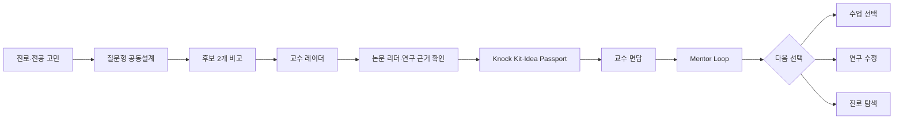

# 전공진화소 제품 기획 기준 · 2026-07-28

이 문서는 2026-07-26 멘토링 전사, 사용자의 2026-07-28 결정, 현재 MVP 구현을 합친 최신 제품 기준이다. 초기 `PRD.md`의 점수형 아이디어 랩과 교수 추천 화면보다 이 문서와 `docs/MVP_SPEC.md`를 우선한다.

## 1. 한 문장 정의

> 전공진화소는 진로와 전공의 갈림길에 선 학생이 공식 근거로 관련 교수를 찾고, 준비해서 만나고, 받은 조언을 수업·연구·진로의 다음 행동으로 바꾸도록 돕는 서비스다.

발표에서는 `교수님을 활용한다` 대신 `교수의 전문성과 학생의 실행을 연결한다`고 표현한다.

## 2. 사용자가 완수할 일

1. 내 관심과 연결되는 교수가 누구인지 이해한다.
2. 교수의 연구와 논문을 읽고 질문을 준비한다.
3. 예의를 갖춰 면담을 요청하고 필요한 자료를 가져간다.
4. 받은 조언을 연구안 수정, 수업 선택, 자료 탐색과 7일 행동으로 옮긴다.

## 3. 핵심 기능 3가지

| 핵심 기능 | 사용자 질문 | MVP 결과 |
|---|---|---|
| 교수 레이더 | 누구를 왜 찾아갈까? | 교수 1명·대안 1명, `TOPIC/METHOD/CONTEXT`, 공식 근거와 직접 확인할 점 |
| 교수 Knock Kit | 무엇을 준비해 갈까? | 논문 이해 메모, 60초 소개, 질문 3개, 20분 안건, 이메일 초안, A4 1페이지 |
| Mentor Loop | 조언을 어떻게 다음 선택으로 바꿀까? | 수정 전후, 수업·연구·진로 행동 3개, 확인 날짜, 후속 연락 |

논문 리더는 네 번째 핵심 기능이 아니다. 교수 레이더와 Knock Kit 사이에서 `원문 이해 → 질문 준비`를 돕는 지원 도구다.

## 4. 유지·추가·축소·제거

| 결정 | 항목 | 적용 방식 |
|---|---|---|
| 유지 | 한 번에 질문 하나 | 사용자의 관심·제약·목표를 확인하며 맥락을 누적 |
| 유지 | 전략이 다른 후보 2개 | 안전 축소형과 차별 심화형을 같은 항목으로 비교 |
| 유지 | 대학 공식 프로필 우선 | KCI·DOI는 공식 프로필 논문의 서지 보강에만 사용 |
| 유지 | 행동 진척도 | `질문 3/5`, `준비물 4/6`처럼 사용자가 완료한 사실만 표시 |
| 추가 | 논문 이해 메모 | 원문·초록이 있을 때만 문제·방법·결과·한계를 정리 |
| 추가 | Idea Passport | 교수에게 보여드릴 편집 가능한 A4 1페이지 |
| 추가 | 선택 분기 | 교수 조언을 수업 탐색·연구 수정·진로 탐색 중 하나 이상으로 연결 |
| 축소 | AI 트렌드 | 최신 사실처럼 단정하지 않고 탐색 질문의 보조 맥락으로만 사용 |
| 축소 | 강의시간표 | 교수 상세의 공식 강의 정보·학교 링크로 제공하고 실시간 위치는 다루지 않음 |
| 축소 | 논문 리더 | 독립 서비스가 아니라 면담 준비 지원 도구로 배치 |
| 제거 | 교수 궁합도·순위 | `87%`, 1위, 성공 확률 대신 연결 이유와 근거를 표시 |
| 제거 | 아이디어 실현성 점수 | `84/100` 대신 데이터·기간·방법·위험·직접 확인할 점을 표시 |
| 제거 | 전공 능력 레이더 | 사용자가 입력하지 않은 능력 수준을 수치로 진단하지 않음 |
| 제거 | 레거시 3개 아이디어 랩 | 최신 MVP 진입 경로에서 제외하고 `/research` 공동설계로 통합 |
| 제외 | 이메일 자동 발송 | 사용자가 검토·복사·직접 발송 |
| 제외 | 외부 계정 자동 로그인·PDF 자동 업로드 | 권한·저작권·오류 복구 검토 후 후속 범위 |

## 5. 점수 제거 원칙

숫자 자체를 모두 금지하지 않는다. 숫자의 의미를 구분한다.

### 사용자에게 표시하지 않는 숫자

- 교수와 학생의 궁합·적합도
- 교수의 우열·인기도·접근 성공 확률
- 아이디어의 성공 가능성·실현성·독창성 점수
- 근거 없는 전공 능력 진단

### 표시할 수 있는 숫자

- 질문과 준비물의 완료 수
- 공식 데이터의 확인 건수와 수집 범위
- 논문 연도·저자 수·강의 학년도와 학기
- 사용자가 직접 설정한 기간과 행동 기한

교수 후보 정렬을 위한 내부 검색 신호는 사용자 평가가 아니다. UI에는 숫자를 노출하지 않고, 선택 근거와 원문 출처를 반드시 제공한다.

## 6. 핵심 사용자 흐름

라우트 기준:

`/mentoring → /research → /co-design → /result → /professors → /professors/{id} → /paper/reader 또는 /quest → /mentor-loop`

## 7. AI와 데이터의 책임 경계

- AI는 사용자가 제공한 맥락을 정리하고 질문·초안을 만든다.
- 교수의 연구분야와 연구실적은 대학 공식 프로필을 기준으로 한다.
- 공식 페이지에 없는 모집·지도·면담 가능성은 추정하지 않는다.
- 원문이나 초록이 없으면 논문의 문제·방법·결과를 생성하지 않는다.
- KCI·Crossref 결과만으로 교수 논문을 새로 귀속하지 않는다.
- 사용자는 이메일과 면담 자료를 검토한 뒤 직접 사용한다.

## 8. MVP 완료 조건

- 점수 없이 후보 2개를 동일한 항목으로 비교한다.
- 교수 1명과 대안 1명의 연결 이유를 공식 근거까지 추적한다.
- 논문 이해 메모가 근거 유무에 따라 안전하게 동작한다.
- Knock Kit와 A4 1페이지 자료를 편집·저장·인쇄한다.
- Mentor Loop가 조언을 수업·연구·진로의 다음 행동 3개로 바꾼다.
- 390px 모바일과 데스크톱에서 전체 흐름을 완주한다.
- 타입 검사, 빌드, 교수 수집기 테스트와 대표 매칭 검증을 통과한다.

## 9. 발표용 메시지

문제:

> 학생에게 교수 정보는 많지만, 누구를 왜 찾아가 무엇을 물어보고 그 조언을 어떻게 행동으로 바꿀지는 알려주지 않습니다.

해결:

> 전공진화소는 공식 근거로 교수를 찾고, 논문과 질문을 준비하고, 받은 조언을 다음 선택으로 연결합니다.

마지막 문장:

> 교수를 검색하는 앱이 아니라, 학생이 교수와 첫 연구와 진로 대화를 시작하도록 돕는 앱입니다.

## 10. 근거 상태

- 2026-07-26 영상: 사용자 제공 `(1)` 파일과 기존 전사 원본의 SHA-256이 동일해 기존 로컬 TXT·SRT·JSON 전사를 근거로 사용했다.
- 2026-07-12 영상: 화면 자막과 별도 자막 파일이 없고 현재 로컬 ASR 도구가 없어 음성 전사 대기 상태다.
- 멘토는 교수 논문 이해·질문·행동 자료 방향을 긍정적으로 평가했지만 전체 E2E를 최종 승인하지 않았다.
