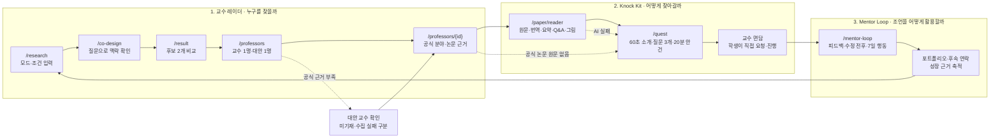
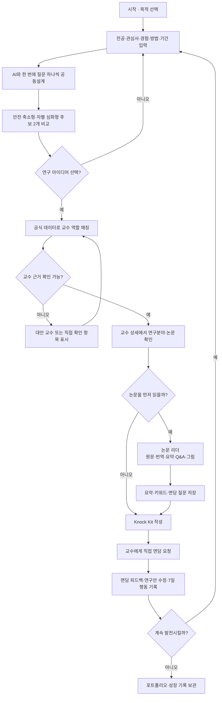

# 전공진화소 서비스 흐름도와 유저플로우

기준일: 2026-07-28
범위: 현재 구현된 교수 연결 MVP + 논문 리더 통합 예정 경계

## 1. 한 문장 서비스 정의

학생이 관심 연구를 구체화한 뒤 **공식 근거로 교수를 찾고, 논문을 이해해 준비된 상태로 만나고, 받은 조언을 연구 수정과 다음 행동으로 바꾸는 서비스**다.

논문 리더는 별도의 네 번째 핵심 기능이 아니라 `교수 레이더 → Knock Kit` 사이를 강화하는 공통 도구다.

## 2. 핵심 기능 3가지와 전체 파이프라인



### 핵심 해석

1. 교수 추천으로 끝나지 않고 실제 면담 준비까지 이어진다.
2. 논문 분석 결과는 독립적으로 소비하지 않고 교수님께 물어볼 질문으로 변환한다.
3. 면담 후 행동을 다시 연구 탐색 입력으로 사용해 반복할수록 기록이 쌓인다.

## 3. 학생 유저플로우



## 4. 데이터와 AI 처리 파이프라인

```mermaid
flowchart LR
    subgraph OFFICIAL["공식 교수 데이터"]
        O1["대학 학과·교수 공식 페이지"] --> O2["robots 준수 수집기"]
        O2 --> O3["교수·학과·연구분야·논문 정규화"]
        O4["DOI·Crossref·KCI 보강"] --> O3
    end

    subgraph STUDENT["학생 확인 데이터"]
        U1["전공·관심·경험·방법"] --> U2["공동설계 답변"]
        U2 --> U3["아이디어 후보 2개"]
    end

    O3 --> MATCH["역할 기반 교수 매칭<br/>TOPIC · METHOD · CONTEXT"]
    U3 --> MATCH
    MATCH --> PROFILE["교수 상세·공식 근거 ID"]

    subgraph PAPER["논문 리더 담당 모듈"]
        PDF["선택 논문 또는 PDF"] --> PARSE["브라우저 텍스트 추출·필요 시 OCR"]
        PARSE --> AI["번역·요약·Q&A·그림 해설"]
        AI --> INSIGHT["PaperReaderInsight<br/>요약·키워드·질문·페이지 근거"]
    end

    PROFILE --> PDF
    INSIGHT --> KIT["Knock Kit"]
    KIT --> FEEDBACK["Mentor Loop"]
    FEEDBACK --> U1
```



### 데이터 신뢰 원칙

- 공식 프로필의 `미기재`와 수집 과정의 `실패`를 구분한다.
- 교수의 우열·합격 가능성·지도 가능성을 숫자 점수로 만들지 않는다.
- AI 답변은 원문 페이지 근거를 표시하고, 인용과 최종 판단은 사용자가 원문에서 확인한다.
- 미공개 논문은 기본적으로 브라우저에서 처리하고 서버 저장 여부를 사용자가 명확히 알 수 있게 한다.

## 5. 화면·라우트 연결표

| 단계 | 라우트 | 핵심 입력 | 핵심 출력 | 현재 상태 |
|---|---|---|---|---|
| 탐색 조건 | `/research` | 전공·관심·경험·방법 | 공동설계 프로필 | 구현 |
| 질문형 공동설계 | `/co-design` | 한 번에 답변 하나 | 사용자 확인 맥락 | 구현 |
| 아이디어 비교 | `/result` | 축적 맥락 | 후보 정확히 2개 | 구현 |
| 교수 목록 | `/professors` | 선택 아이디어 | 교수 1명·대안 1명 | 구현 |
| 교수 상세 | `/professors/[id]` | 교수 ID | 공식 분야·논문·근거 | 구현 |
| 논문 리더 | `/paper/reader` | 선택 논문 또는 PDF | `PaperReaderInsight` | 통합 셸 구현, 담당 개발 예정 |
| 기존 텍스트 분석 | `/paper` | 초록·본문 텍스트 | 구조화 요약 | 구현 |
| 면담 준비 | `/quest` | 교수·주제·논문 이해 | Knock Kit | 구현, 논문 메모 연동 예정 |
| 면담 후속 | `/mentor-loop` | 교수 피드백 | 수정 전후·7일 행동 | 구현 |

## 6. 팀 역할 경계

| 담당 | 책임 | 넘겨주는 값 | 받는 값 |
|---|---|---|---|
| 전공진화소 코어 | 교수 탐색·공식 근거·Knock Kit·Mentor Loop | `PaperReaderSource` | `PaperReaderInsight` |
| 논문 리더 담당 개발자 | PDF 원문·번역·요약·Q&A·그림 해설 | 분석 진행 상태·오류 상태 | 선택 논문·교수 맥락 |
| 공동 검수 | 모바일·개인정보·출처·실패 복구 | 검수 이슈 | 수정 완료 증거 |

연동 타입의 단일 기준은 `lib/paper-reader-contract.ts`다.

## 7. 대표 E2E 검수 경로

```text
/research
→ /co-design
→ /result
→ /professors
→ /professors/{id}
→ /paper/reader
→ /quest
→ /mentor-loop
```

- 새로고침 뒤 선택 교수와 논문 맥락이 유지되어야 한다.
- 논문 리더 없이도 `/quest`로 이동할 수 있어야 한다.
- 논문 분석 실패가 교수 매칭과 면담 준비 데이터를 지우면 안 된다.
- 390px 모바일에서 원문·번역·Q&A 영역이 가로로 잘리지 않아야 한다.
