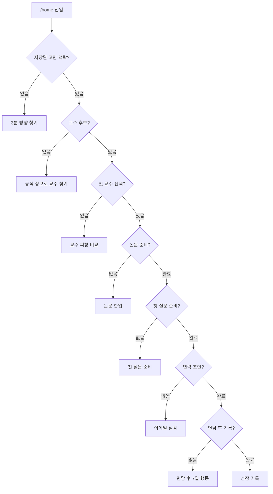

# 너의 교수님은? 서비스 흐름

기준일: 2026-08-23

범위: 랜딩·튜토리얼·교수 연결·대화 준비·AI 프로젝트·맞춤 교수 추천·프로젝트 실행·면담 후 행동·성장 기록

## 한 문장 서비스 정의

대학생이 전공·진로 고민을 자연스럽게 정리하고, 학교 공식 정보로 지금 대화할 교수를 찾은 뒤, 첫 질문과 다음 행동까지 준비하는 서비스다.

AI는 교수를 평가하거나 진로의 답을 대신하지 않는다. 학생 입력과 공식 정보를 정리해 연결 이유와 직접 확인할 질문을 만드는 역할을 맡는다.

## 전체 사용자 여정

```mermaid
flowchart LR
  L["/ 공개 랜딩"] --> T["/tutorial 고민 정리"]
  T --> P["/professors/pitch 교수 피칭"]
  P --> S["첫 교수 선택"]
  S --> QH["/quest 대화 준비 허브"]
  QH --> R["논문 한입"]
  R --> Q["첫 질문"]
  Q --> E["이메일 초안"]
  E --> M["면담·피드백 기록"]
  M --> D["7일 행동·성장 기록"]
  D --> H["/portfolio 성장 기록 허브"]
  H --> AI["/portfolio/ai-professor 나의 AI 교수님"]
  AI --> H
  AI -. "실제 교수에게 확인할 질문" .-> QH
  AI -. "프로젝트로 구체화" .-> I

  H -. "관심사를 더 구체화" .-> I["/research/tutorial 아이디어 조건 정리"]
  I --> C["/co-design 아이디어 공동설계"]
  C --> O["/result 후보 이해·선택"]
  O --> OC["/result/compare 선택 후보 상세 근거 비교"]
  OC --> PM["/project-professors 선택 프로젝트의 멘토 교수 연결"]
  PM --> PX["/project-execution 프로젝트 실행 홈"]
  PX --> PA["/project-meeting 프로젝트 교수 자문 준비"]
  PA --> PX
```

### 흐름 원칙

1. 튜토리얼 직후에는 대시보드를 거치지 않고 약속한 교수 피칭을 바로 보여준다.
2. 교수 선택 버튼은 대화 준비 허브로 바로 이어지고, 이후 홈은 저장 상태를 읽어 다음 행동 하나를 제안한다.
3. 논문 한입은 필수 관문이 아니다. 공식 논문이 미기재되거나 학생이 원하지 않으면 첫 질문으로 건너뛸 수 있다.
4. 연구 아이디어는 선택적 심화 기능이다. 대학생의 일반적인 전공·진로 고민도 교수 대화로 연결할 수 있다.
5. 연락·면담·최종 선택은 학생이 직접 진행한다.
6. 전공 아이디어 튜토리얼은 최종 확인 전까지 교수 연결과 성장 기록을 바꾸지 않는다.
7. 최상위 허브는 세부 기능을 모두 펼치지 않고, 저장 상태에 맞는 다음 행동 하나와 짧은 행 목록만 보여준다.
8. 공동설계는 공통 질문 3개로 비교 기준을 확보한 뒤, OpenAI API가 그 답변에 맞는 후속 질문 2개를 생성한다.
9. 첫 교수 연결은 학생의 전공·진로 고민을 기준으로 하고, 아이디어 이후 교수 연결은 선택 프로젝트의 주제·방법·범위를 기준으로 분리한다.
10. 프로젝트 멘토 AI는 공식 데이터 규칙으로 좁힌 후보만 재정렬하며, 교수·논문·모집 여부나 성공 가능성을 새로 만들지 않는다.
11. 첫 교수 피칭은 같은 학과 교수 한 명을 가장 가까운 시작점으로 먼저 보여주고, 나머지 두 명은 다른 학과의 주제 연결형·방법 연결형으로 제안한다. 같은 학과라는 사실과 연구주제 적합성은 별도 근거로 설명한다.
12. 나의 AI 교수님은 실제 교수를 대신하지 않는 상시 사고 정리 파트너다. 진로 고민·프로젝트 생각을 대화로 구체화하고, 사용자가 직접 선택한 요약만 성장 메모로 남긴다.
13. AI 대화에서 공식 학사 정보, 교수의 의도, 지도 가능성, 프로젝트 성공을 확정하지 않는다. 중요한 판단은 실제 교수 또는 학교 공식 안내로 이어간다.
14. 일반 교수 만남과 프로젝트 교수 자문은 선택 교수·질문·저장 기록을 분리한다. 두 선택은 공존하며 한쪽 선택이 다른 여정을 지우지 않는다.
15. 프로젝트 교수 선택 뒤에는 추천 화면을 반복하지 않고 실행 홈에서 계획·자문·자료·반영 상태를 이어간다.

## 주요 내비게이션 순서

`홈 → 교수 매칭 → 교수 만남 준비 → AI 프로젝트 설계 → 프로젝트 실행 → 나의 성장과정`

- 첫 여정은 학생의 고민을 기준으로 교수를 매칭하고 실제 만남을 준비한다.
- 두 번째 여정은 AI와 프로젝트를 설계한 뒤 선택한 프로젝트의 주제·방법·응용 맥락에 맞는 교수를 추천한다.
- 프로젝트 실행 탭은 프로젝트가 없으면 설계 시작, 후보만 있으면 주제 선택, 교수 선택 전에는 맞춤 교수 추천, 선택 뒤에는 실행 홈으로 이어져 빈 화면을 만들지 않는다.
- 나의 성장과정 탭은 두 여정에서 직접 선택·저장한 관심, 프로젝트, 교수 연결, 대화 준비 기록만 시간 순서로 보존한다.
- 성장과정의 `나의 AI 교수님`은 저장된 전공·관심·프로젝트·교수 연결을 대화 맥락으로만 참고하며, 대화와 성장 메모를 각각 삭제할 수 있다.

## 상태 기반 홈

홈은 완료하지 않은 가장 앞 단계 하나만 주 행동으로 제시한다. 나머지 기능은 진행 레일과 `전체 기능` 목록에서 언제든 비선형으로 이동할 수 있다.

## 화면 연결표

| 단계 | 라우트 | 입력 | 출력·저장 | 다음 상태 |
| --- | --- | --- | --- | --- |
| 서비스 이해 | `/` | 없음 | 없음 | 튜토리얼 |
| 교수 찾기 허브 | `/professors` | 저장된 교수 연결 상태 | 다음 교수 행동 | 튜토리얼·피칭·대화 준비 |
| 교수 조건 직접 입력 | `/professors/discover` | 학교·전공·관심·진로 고민 | 교수 매칭 조건 | 교수 피칭 |
| 고민 정리 | `/tutorial` | 전공·현재 단계·필요 도움·관심·고민 | `professorDiscoveryTopic`, 교수 매칭 | 교수 피칭 |
| 교수 비교 | `/professors/pitch` | 학생 고민·공식 교수 정보 | 같은 학과 1명·타 학과 주제/방법 2명, `selectedProfessorId` | 대화 준비 허브 |
| 상태 허브 | `/home` | 저장된 전 여정 상태 | 다음 행동·진행률·최근 기록 | 미완료 단계 |
| 교수 상세 | `/professors/[id]` | 교수 ID | 공식 분야·논문·출처 확인 | 논문 또는 대화 준비 |
| 논문 한입 | `/paper/reader?mode=bite&source=favorites` | 연결 교수·공식 논문·공개 초록/허용된 공개 PDF 텍스트·학생 제공 텍스트 | 편집 가능한 5카드 | 첫 질문 |
| 첫 질문 | `/quest/first-line` | 교수 근거·학생 목적 | 학생이 편집한 첫 문장 | 이메일 준비 |
| 대화 준비 허브 | `/quest` | 현재 교수·저장 카드 | 다음 준비 행동·단계 요약 | 각 퀘스트 |
| 전체 대화 도구 | `/quest/all` | 현재 교수·저장 카드 | 5개 도구·저장 카드 | 각 퀘스트 |
| 이메일 | `/quest/email-guard` | 교수·학생 고민 맥락 | 소개·질문·이메일 초안 | 학생 직접 연락 |
| 면담 후 | `/mentor-loop` | 교수 피드백 | 수정 전후·7일 행동 | 성장 기록 |
| 성장 기록 허브 | `/portfolio` | 실제 저장 결과·첫 관심 스냅샷·프로젝트/교수 연결 이력 | 관심 변화·완료 단계·연결 교수·다음 빈 단계 | 기록 만들기·재방문 홈 |
| 나의 AI 교수님 | `/portfolio/ai-professor` | 저장된 전공·관심·프로젝트·교수 연결, 최근 대화 | AI 답변·이어갈 말 3개·사용자 선택형 성장 메모 | 성장 기록·실제 교수 만남 준비·프로젝트 설계 |
| 포트폴리오 만들기 | `/portfolio/builder` | 실제 저장 결과 | 선택 단계 미리보기·PDF | 성장 기록 허브 |
| 내 기록 관리 | `/portfolio/manage` | 저장 종류별 건수 | 사용자 확인 후 삭제 | 성장 기록 허브 |
| 프로젝트 설계 홈 | `/research` | 저장된 조건·공동설계·후보·선택 상태 | 현재 진행률·프로젝트 요약·다음 행동 | 조건 정리·공동설계·후보 비교 |
| 아이디어 조건 정리 | `/research/tutorial` | 전공·탐색 방식·관심·경험·방법·기간·자료 | 브라우저 임시 초안 | 공동설계 |
| 저장 조건 빠른 수정 | `/research/conditions?view=review` | 저장된 프로젝트 조건 | 전체 조건 요약·항목별 단계 수정 | 공동설계 |
| 아이디어 공동설계 | `/co-design` | 최종 확인한 조건·공통 답변 3개 | API 맞춤 후속 질문 2개·사용자 확인 답변 5개 | 후보 비교 |
| 아이디어 후보 선택 | `/result` | 조건·공동설계 답변 | 핵심 차이·데이터·방법·범위가 요약된 후보 2개 | 선택 후보 상세 근거 비교 |
| 아이디어 상세 근거 비교 | `/result/compare` | 후보 2개·선택 상태 | 항목별 접이식 비교·전체 근거·최종 후보 선택 | 맞춤 교수 추천 허브 |
| 맞춤 교수 추천 허브 | `/project-professors` | 학생이 고른 아이디어·공식 교수 후보 | AI 재정렬한 주제·방법·확장 관점 교수 3명·역할별 요약 | 프로젝트 실행 홈 |
| 프로젝트 실행 홈 | `/project-execution` | 선택 프로젝트·선택 자문 교수·프로젝트 실행 초안 | 4단계 진행률·다음 실행 계획 | 프로젝트 자문 준비·근거 재확인 |
| 프로젝트 교수 자문 준비 | `/project-meeting` | 선택 프로젝트·선택 자문 교수 | 자문 목표·질문 3개·자료 체크·자문 후 반영 | 프로젝트 실행 홈 |

## 데이터·신뢰 경계

- 교수 이름·소속·연구분야·논문은 대학 공식 프로필 공개 범위에서 사용한다.
- `미기재`와 `수집 실패`를 구분한다.
- 교수 궁합 점수·순위·면담 가능성·지도 가능성을 만들지 않는다.
- 튜토리얼 입력은 학생이 확인한 고민 맥락으로만 저장하며 공식 교수 근거처럼 표시하지 않는다.
- 논문 제목과 서지는 공식 프로필에서 다시 확인한다. 서비스의 공식 목록 서지는 모두 보여주되 공개 초록·PDF는 논문을 선택할 때 조회한다. 공개 초록은 DOI 우선, 제목·발행일 보조 검증 뒤 자동 입력한다. 정확 일치 실패 후 같은 교수의 공식 목록에서 제목이 확장된 공개 논문이 확인되면 제목·연도·DOI 후보를 보여주고 학생 확인 뒤에만 입력한다. 조회 결과는 서버에서 최대 30일간 재사용한다. 확인된 관련 논문의 공개 PDF는 교수 ID·원래 논문 ID·확인한 관련 논문 ID를 서버에서 다시 검증한 뒤 10MB·40쪽 이하만 브라우저 메모리로 전달하며, 디스크나 로컬 저장소에 파일을 남기지 않는다. PDF 자동 추출은 재사용 가능한 오픈 라이선스와 검증된 공개 학술 저장소를 모두 충족한 경우로 제한한다.
- 홈의 최근 기록과 진행률은 실제 저장 데이터로만 계산한다.
- 전공 아이디어 튜토리얼 초안은 로컬 임시 저장이며, `공동설계 시작` 전에는 기존 교수 연결 상태를 덮어쓰지 않는다.
- `OPENAI_API_KEY`는 서버의 `.env.local`에서만 읽고 브라우저 응답과 Git 저장소에 포함하지 않는다.
- 맞춤 후속 질문은 사용자 답변을 다시 확인하기 위한 질문이며, 사실·성과·권한을 확정하지 않는다.
- 프로젝트 멘토 AI에 전달되는 교수는 공식 프로필 근거 규칙으로 역할별 상위 후보만 추린다. AI는 제공된 후보 ID 밖의 교수를 선택할 수 없다.
- 프로젝트 실행 초안은 `프로젝트 ID + 교수 ID` 조합으로 브라우저에 별도 저장하며 일반 교수 만남의 질문·메일·면담 후 기록과 섞지 않는다.
- 나의 AI 교수님 대화는 최대 최근 12개 메시지만 서버에 전달하고, 브라우저에는 최근 40개 메시지와 사용자가 직접 저장한 메모 최대 20개를 보존한다.
- AI 응답은 자동으로 성장 기록이 되지 않는다. 학생이 `성장 메모로 남기기`를 누른 요약만 기록한다.
- AI 교수님은 실제 교수·지도교수·상담사·학사 담당자가 아니며, 교수의 의견·면담 가능성·성공 가능성을 대신 판단하지 않는다.

## 실패·복구

- 교수 매칭 실패: 입력을 보존하고 재시도한다.
- 공식 논문 없음 또는 공개 초록·허용 PDF 미확보: 논문이 없다고 단정하지 않고 공식 프로필 확인·관련 공개 논문 후보 확인·직접 입력·건너뛰기를 제공한다. 후보는 같은 교수 공식 목록의 제목 확장 관계와 근접 발행연도를 충족할 때만 제시하며, 학생 확인 전에는 내용을 대신 입력하지 않는다. 라이선스 미확인 PDF는 사용하지 않는다.
- AI 분석 실패: 학생 입력과 교수 선택을 보존한 채 수동 편집으로 전환한다.
- 맞춤 질문 API 실패: 공통 답변을 보존하고 검수된 방법·결과물 후속 질문 2개로 이어간다.
- 프로젝트 멘토 AI 재정렬 실패: 공식 교수 후보와 기존 결정 규칙 결과로 이어가며 실패 때문에 교수 정보를 만들지 않는다.
- 새로고침: 저장소 복원 전에는 로딩 상태를 보여주고, 복원 후 정확한 다음 행동을 계산한다.
- 연결한 교수가 즐겨찾기에 없어도 논문 선택 목록에 현재 연결 교수를 포함한다.
- 연구 아이디어를 만들지 않은 학생도 튜토리얼 고민 맥락으로 첫 질문·이메일·면담 기록을 이어간다.
- 전공 아이디어 튜토리얼 이탈: 같은 브라우저에서 마지막 단계와 입력을 복원하고, 저장된 조건은 `/research/conditions?view=review`에서 한눈에 확인한 뒤 항목별로 수정한다.
- AI 교수님 대화 실패: 방금 보낸 학생 메시지를 보존하고 같은 내용을 다시 보낼 수 있게 하며, 성장 메모는 자동 생성하거나 저장하지 않는다.

상세 홈 상태 계약과 시각 검수는 `design/home-dashboard-v2/`를 기준으로 한다.
전공 아이디어 튜토리얼의 흐름·상태·PC/모바일 시각 기준은 `design/research-tutorial-v1/`을 기준으로 한다.
토스·당근 구조 원칙을 적용한 교수·대화 준비·성장 기록 허브는 `design/service-hubs-v1/`을 기준으로 한다.
AI 생성형 템플릿의 흔적을 줄인 공통 간격·반경·그림자·미디어 규칙과 검증 화면은 `design/front-polish-v1/`을 기준으로 한다.
