# 추천 앱에서, 첫 대화를 만드는 서비스로 — ‘너의 교수님은?’ 최종 개발 기록

> 대학생의 막막한 전공·진로 고민을 정리하고, 학교 공식 정보로 지금 대화할 교수를 찾은 뒤, 첫 질문과 다음 행동까지 준비하는 서비스.

팀 트리온 — 팀장 이연수, 팀원 최현규·이진재
프로젝트: 전공진화소 · 너의 교수님은?

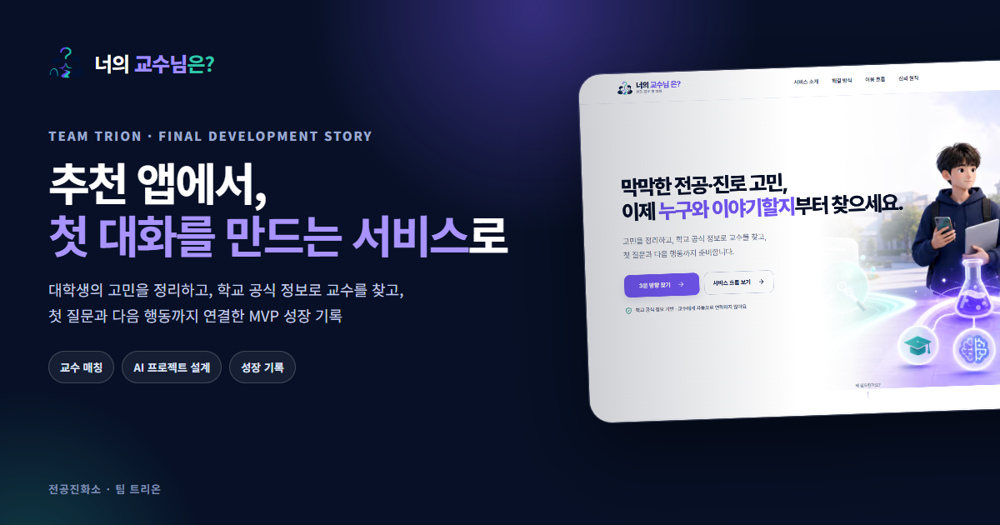

*팀 트리온이 멘토링과 반복 개발을 거쳐 만든 ‘너의 교수님은?’ 최종 개발 기록*

---

## 처음에는 ‘잘 맞는 교수’를 추천하려고 했다

처음 기획한 서비스는 AI가 학생의 전공과 관심사를 분석해 연구 아이디어와 잘 맞는 교수를 추천하는 앱이었다. 전공 DNA, 추천 점수, 교수 순위처럼 결과를 빠르게 이해할 수 있는 장치를 만들었다.

하지만 화면을 구체화할수록 두 가지 질문이 남았다.

1. 이 점수와 순위를 학생이 왜 믿어야 하는가?
2. 추천 결과를 확인한 학생은 실제로 무엇을 해야 하는가?

교수 정보를 보여주는 것과 학생이 교수에게 첫 질문을 건네는 것 사이에는 생각보다 큰 간격이 있었다. 대학생이 막히는 지점은 단순히 정보가 부족해서가 아니라, **내 고민을 누구에게 어떤 말로 시작해야 하는지 모르기 때문**이었다.

그래서 서비스의 중심 질문을 바꿨다.

> “어떤 교수를 추천할까?”가 아니라, “학생이 실제 교수와 첫 대화를 시작하고 그 조언을 다음 행동으로 옮기려면 무엇이 필요할까?”

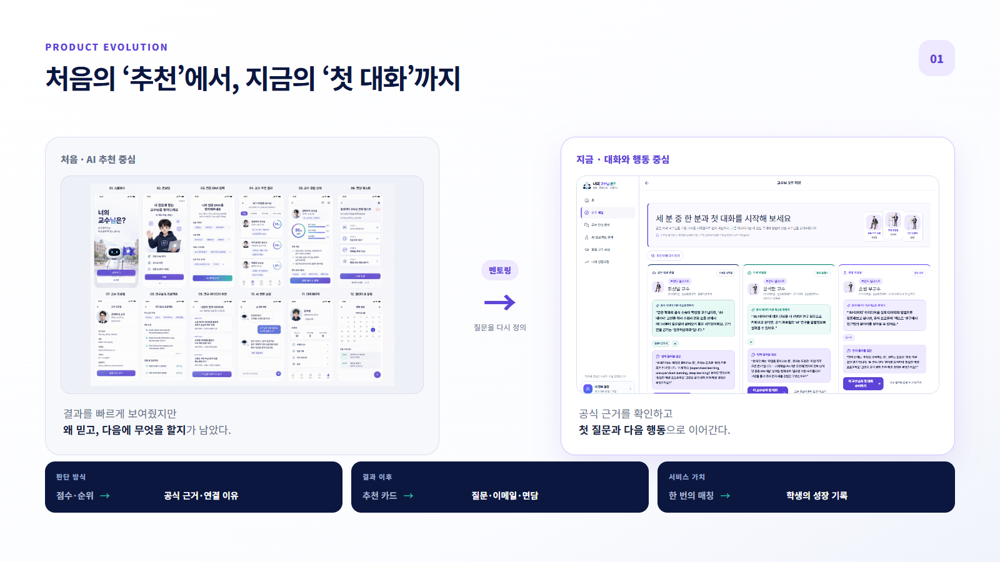

*추천 점수와 순위를 보여주던 초기 초안에서, 공식 근거와 첫 질문·다음 행동을 연결하는 현재 서비스로 변화했다.*

---

## 오늘 개발의 기준은 ‘사용자가 길을 잃지 않는 것’이었다

기능이 늘어나면서 또 다른 문제가 생겼다. 홈, 교수 매칭, 대화 준비, 프로젝트 설계, 성장 기록이 연결되어 있었지만 한 화면에 설명과 선택지가 많아졌다. 사용자는 서비스를 이해하기 전에 스크롤을 내리고, 여러 버튼 가운데 다음 행동을 다시 판단해야 했다.

오늘은 토스와 당근의 서비스 구조를 참고해 세 가지 원칙으로 화면을 다시 정리했다.

- 한 화면에서는 하나의 핵심 행동을 먼저 보여준다.
- 사용자의 현재 상태에 맞는 다음 행동을 제안한다.
- 자세한 도구와 설정은 필요할 때 들어가는 별도 화면으로 분리한다.

새 기능을 많이 더하기보다, 이미 구현된 기능 사이에서 사용자가 해야 했던 불필요한 판단을 줄이는 데 집중했다.

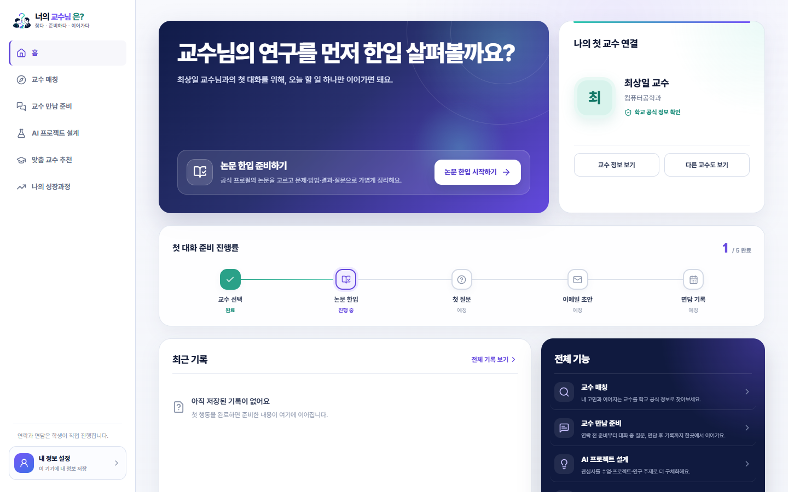

*교수를 선택한 사용자가 다시 들어오면, 기능 목록 대신 지금 이어갈 한 가지 행동을 먼저 보여준다.*

---

## 이번 개발에 실제로 적용한 ‘코덱스 X 클로드 바이브코딩’ 1~2강 후기

이번 개발 과정에는 **코덱스 X 클로드 바이브코딩 강의**에서 배운 기준도 직접 적용했다. 단순히 AI에게 코드를 만들어 달라고 요청하는 사용법보다, 아이디어의 크기를 줄이고 직접 완성·검증하는 사고방식을 배울 수 있었다는 점이 특히 도움이 됐다.

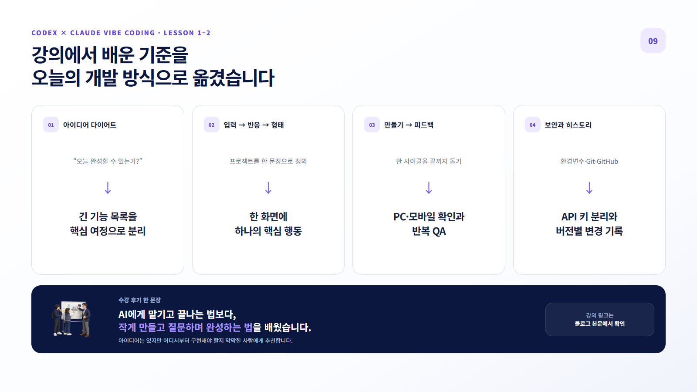

*아이디어 다이어트, 한 화면의 핵심 행동, 반복 QA, API 키와 변경 이력 관리를 실제 개발 방식으로 옮겼다.*

### 1강 — 만들 수 있을 만큼 줄이고, 한 사이클을 끝까지 돌기

1강에서 가장 기억에 남은 내용은 “못 만드는 이유는 아이디어가 나빠서가 아니라 너무 커서”라는 설명이었다. 하고 싶은 기능을 모두 적는 대신 프로젝트를 **입력 → 반응 → 형태**의 한 문장으로 정의하고, 오늘 안에 완성할 수 있을 만큼 핵심을 남기는 ‘아이디어 다이어트’가 필요하다는 내용이었다.

이 기준을 우리 서비스에 적용하자 해야 할 일이 선명해졌다. 교수 추천, 프로젝트 설계, 면담 준비, 성장 기록을 한 화면에서 모두 설명하려던 방식에서 벗어나 각 화면의 핵심 행동을 하나씩 나눴다. 긴 프로젝트 입력 화면도 여섯 단계로 쪼갰다. 기능을 빼는 일이 손해가 아니라 사용자가 덜 헤매게 만드는 무기가 될 수 있다는 점을 실제로 체감했다.

또한 “만들기 → 반응 보기 → 피드백”의 한 사이클을 돌고, 만든 것은 다른 사람이 볼 수 있는 상태로 배포해야 한다는 내용도 인상적이었다. 이번 작업에서도 화면을 수정하는 데서 끝내지 않고 PC·모바일 화면 확인, 자동 테스트, 실제 사용자 피드백 반영까지 한 흐름으로 이어가려 했다. API 키를 코드에 직접 넣지 않고 환경변수로 분리하고, Git과 GitHub로 변경 이력을 남기는 기본 원칙도 다시 점검했다.

### 2강 — 모르는 것을 질문하고, 작업 과정을 내 학습으로 남기기

2강에서는 짧은 웹 프로그램 제작을 돌아보며, 결과물만 얻는 것보다 **“이 단어는 무엇인지, 이 행동은 왜 필요한지, 이번 세션에서 무엇을 배울 수 있는지” 질문하는 태도**가 중요하다고 강조했다. AI가 코드를 만들어 주더라도 과정을 이해하지 못하면 다음 수정에서 다시 막힐 수 있기 때문이다.

우리 팀도 오늘 AI와 여러 화면을 수정하면서 단순히 “예쁘게 바꿔줘”라고 끝내지 않았다. 사용자가 왜 다음 버튼을 찾지 못하는지, 첫 화면의 AI 문장이 왜 어색한지, 반복되는 점검을 어떤 테스트와 작업 규칙으로 남길지를 계속 질문했다. 반복 작업은 스킬과 체크리스트로 정리하고, 수정 전후 화면을 기록했다. 덕분에 AI를 결과물 생성기로만 쓰기보다 팀의 생각을 빠르게 구현하고 검증하는 협업 도구로 활용할 수 있었다.

### 이런 분이라면 특히 추천하고 싶다

- 아이디어는 있지만 어디서부터 만들어야 할지 막막한 사람
- 개발 경험이 많지 않아도 AI와 작은 결과물을 직접 완성해 보고 싶은 사람
- AI가 만든 코드를 그대로 받는 데서 끝나지 않고, 질문·수정·배포의 흐름을 익히고 싶은 사람
- 큰 기획을 실제로 검증할 수 있는 MVP로 줄이는 방법이 필요한 사람

저희처럼 “기획은 많은데 실제 화면으로 옮기는 과정에서 자꾸 커지는” 팀이라면, 1~2강만으로도 프로젝트를 바라보는 기준을 세우는 데 도움이 될 수 있다. 강의 내용을 따라 작은 결과물부터 직접 완성해 보고 싶다면 아래 링크에서 확인할 수 있다.

### [▶ 코덱스 X 클로드 바이브코딩 강의 보러 가기](https://bit.ly/4vGYEgi)

*이 링크를 통해 실제 수강이 발생하면 팀에 리워드가 제공될 수 있습니다. 후기는 1~2강을 직접 수강하고 이번 프로젝트에 적용한 경험을 바탕으로 작성했습니다.*

---

## 1. 교수 연결과 프로젝트 설계를 두 개의 명확한 여정으로 나눴다

서비스 하단 탭과 PC 메뉴를 기능 이름이 아닌 사용자의 목표 순서로 재배치했다.

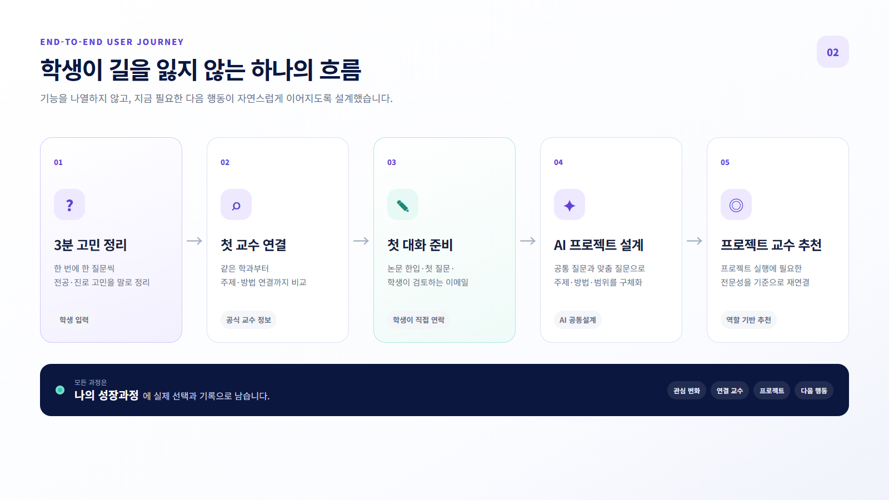

*기능을 나열하기보다 사용자가 지금 해야 할 다음 행동이 자연스럽게 이어지는 하나의 여정으로 설계했다.*

### 교수와 첫 대화를 시작하는 여정

`교수 매칭 → 교수 만남 준비 → 성장 기록`

학생이 전공·진로 고민을 정리하면 본인 학과 교수 한 명을 ‘가까운 시작점’으로 먼저 제안한다. 이어서 다른 학과의 주제 연결형 교수와 방법 연결형 교수를 보여준다. 세 교수를 순위로 세우지 않고, 학생이 어떤 도움을 얻고 싶은지에 따라 선택할 수 있도록 역할을 구분했다.

교수를 선택한 뒤에는 논문 한입, 첫 질문, 이메일 초안, 면담 후 7일 행동으로 이어진다. 연락과 최종 선택은 자동화하지 않으며 학생이 직접 검토하고 진행한다.

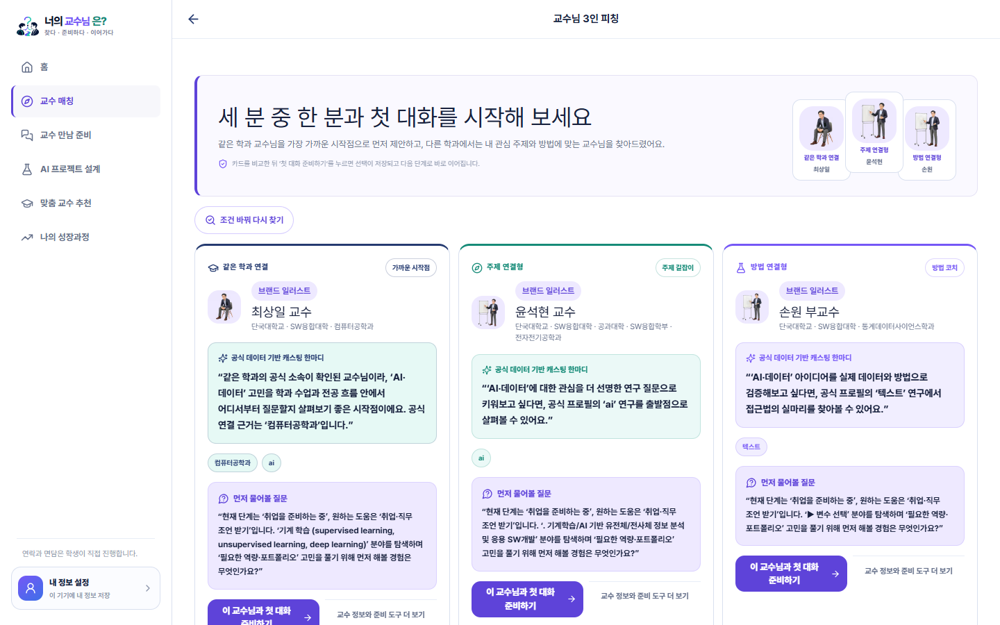

*순위 대신 역할을 보여주고, 한 번의 선택으로 첫 대화 준비 과정에 진입하도록 단순화했다.*

### 나만의 프로젝트를 구체화하는 여정

`AI 프로젝트 설계 → 맞춤 교수 추천`

이 흐름은 학생 개인의 진로 고민을 위한 첫 교수 연결과 분리했다. AI와 프로젝트의 주제·방법·범위를 구체화한 뒤, 선택한 프로젝트의 실행에 필요한 전문성을 기준으로 교수를 다시 찾는다.

첫 교수 매칭은 ‘나의 고민’을 기준으로 하고, 프로젝트 교수 추천은 ‘프로젝트의 성공적인 실행에 필요한 전문성’을 기준으로 한다.

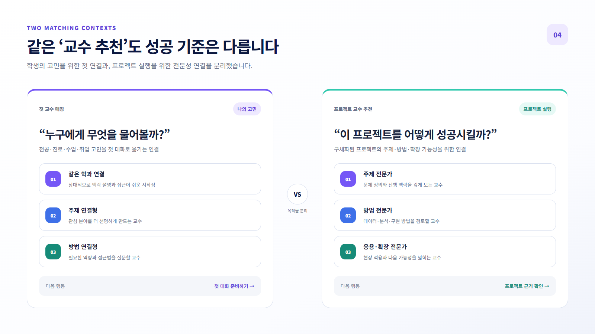

*첫 연결은 같은 학과·주제·방법의 역할로, 프로젝트 연결은 주제·방법·응용 전문성으로 나눠 성공 기준을 분리했다.*

---

## 2. 긴 프로젝트 입력 화면을 6개의 짧은 단계로 바꿨다

기존 프로젝트 설계 화면은 탐색 방식부터 학교, 전공, 관심 분야, 경험, 방법, 기간, 자료까지 한 페이지에 이어져 있었다. 사용자는 입력을 시작하기 전에 긴 화면 전체를 먼저 마주해야 했다.

오늘 이 화면을 다음 여섯 단계로 나눴다.

`방향 → 전공 → 관심 → 준비 → 실행 → 최종 확인`

각 화면에서는 하나의 맥락만 확인한다. 이전·다음 버튼은 항상 하단에 노출하고, 상단 단계 메뉴를 눌러 원하는 항목으로 바로 이동할 수 있도록 했다. 답변은 브라우저에 자동 저장되며, 한 단계씩 질문받는 방식과 직접 입력하는 방식 사이를 오가도 기존 입력을 유지한다.

PC에서는 페이지 자체의 불필요한 스크롤을 제거했고, 모바일에서는 현재 단계의 내용만 필요한 만큼 스크롤되도록 구성했다.

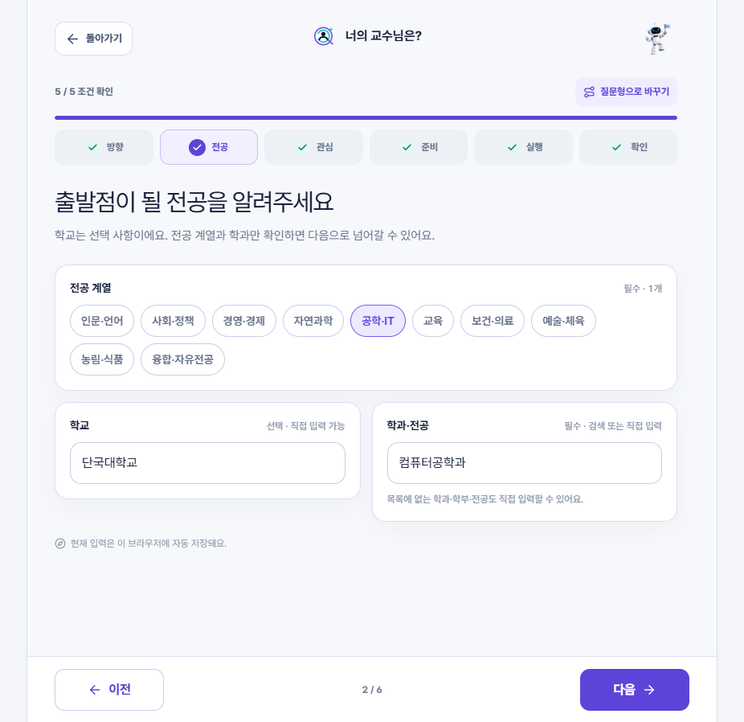

*PC에서는 단계 이동과 현재 입력을 한 화면에 정리했다.*

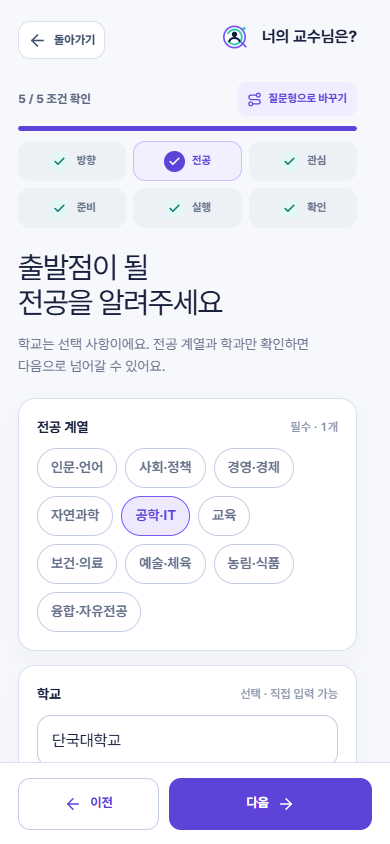

*모바일에서는 현재 단계만 필요한 만큼 보여주고, 이전·다음 행동을 하단에 고정했다.*

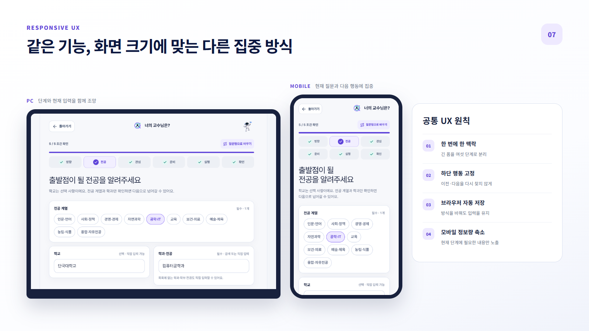

*같은 기능이라도 PC는 단계 전체를 조망하고, 모바일은 현재 질문과 다음 행동에 집중하도록 정보량을 조정했다.*

---

## 3. AI 공동설계를 ‘고정 설문’이 아닌 대화로 다듬었다

AI 공동설계는 공통 질문 세 개로 기본 비교 기준을 만든 뒤, 앞선 답변을 바탕으로 API가 맞춤 후속 질문 두 개를 생성한다. API 연결이 지연되면 사용자의 기존 답변을 보존하고 검수된 기본 질문으로 흐름을 이어간다.

오늘은 첫 화면에서 AI가 말하는 방식도 다시 다듬었다.

기존에는 사용자가 아직 답하지 않았는데도 “좋은 질문이에요” 또는 근거 확인 안내가 먼저 나왔다. AI가 질문한 직후의 대화로는 어색했다.

수정한 첫 메시지는 사용자의 전공을 반영해 먼저 인사하고, 공동설계가 어떤 방식으로 진행되는지 설명한다.

> “반가워요, 컴퓨터공학과에서 시작해 볼게요. 앞에서 정리한 관심과 준비 조건을 바탕으로 프로젝트 방향을 한 단계씩 좁혀볼게요. 첫 질문에는 정답이 없으니 가장 가까운 방향을 고르거나 떠오르는 생각을 직접 적어 주세요.”

두 번째 질문부터는 “앞선 답변을 반영했어요”라고 안내해 질문이 개인화되어 이어진다는 점을 자연스럽게 보여준다.

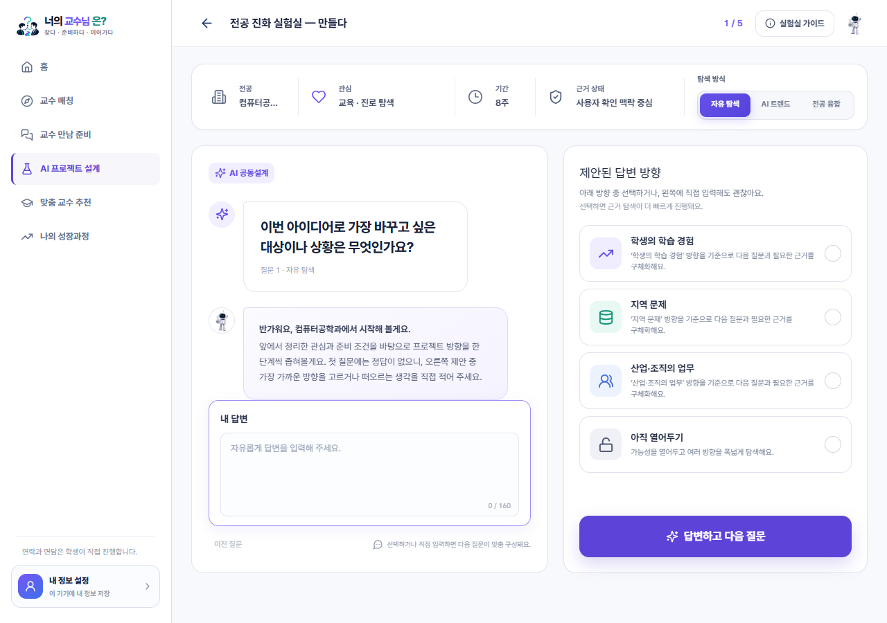

*선택지와 직접 입력을 함께 제공하고, 공통 질문 뒤에는 앞선 답변을 반영한 맞춤 질문으로 이어진다.*

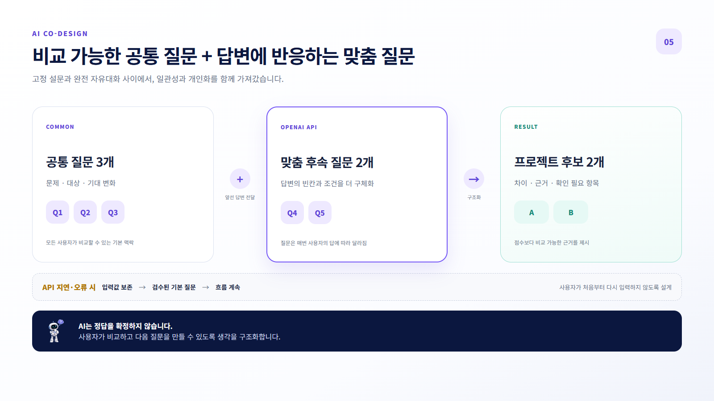

*모든 사용자가 비교할 수 있는 공통 맥락은 유지하되, 후속 질문은 앞선 답변의 빈칸과 조건에 맞춰 생성한다.*

---

## 4. ‘교수 만남 준비’를 숨은 도구가 아니라 핵심 과정으로 올렸다

교수를 추천하는 것보다 중요한 것은 실제 대화를 준비하는 일이다. 그래서 교수 만남 준비 탭을 독립된 허브로 정리했다.

사용자는 이곳에서 현재 연결한 교수와 준비 단계를 확인하고 다음 행동 하나를 선택한다.

- 공식 프로필에 공개된 논문을 짧게 이해하는 ‘논문 한입’
- 교수에게 건넬 첫 질문 준비
- 학생이 직접 검토하는 이메일 초안
- 면담 이후 받은 조언과 7일 행동 기록

모든 도구를 첫 화면에 펼치지 않고, 지금 필요한 한 단계와 전체 도구 보기 경로를 분리했다. 덕분에 사용자는 기능 목록을 해석하기보다 현재 멈춘 지점에서 바로 이어갈 수 있다.

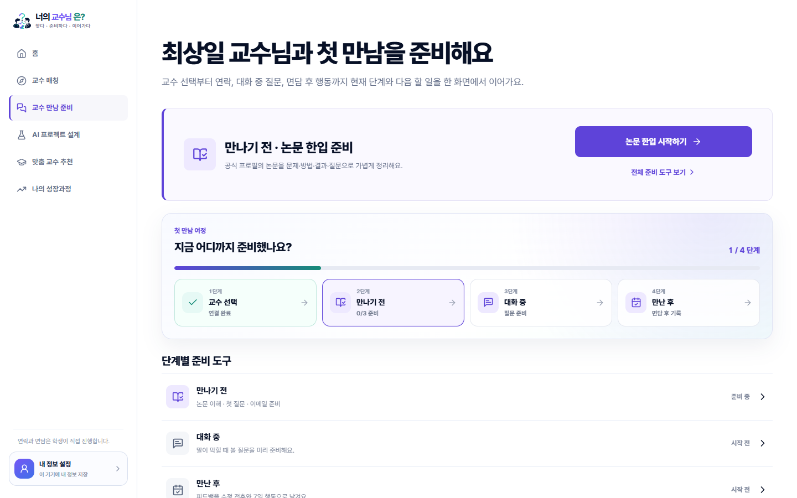

*‘만나기 전 → 대화 중 → 만난 후’의 여정과 지금 해야 할 한 가지 행동을 함께 보여준다.*

---

## 5. 추천 결과보다 학생의 변화가 남도록 성장 기록을 만들었다

새 프로젝트를 만들 때마다 이전 관심과 교수 연결이 사라지면, 학생은 자신이 어떤 고민에서 출발해 무엇을 선택했는지 확인하기 어렵다.

그래서 ‘나의 성장과정’을 독립 탭으로 만들었다. 여기에는 실제로 저장한 정보만 시간 순서로 남는다.

- 처음 입력한 관심과 진로 고민
- 구체화한 프로젝트
- 연결한 학생 고민형 교수와 프로젝트형 교수
- 준비한 질문과 면담 이후 행동

성장 기록 안에는 ‘나의 AI 교수님’도 추가했다. 실제 교수는 학생의 모든 고민을 수시로 함께 정리하기 어렵다. AI는 실제 교수를 대신하지 않고, 진로 고민과 프로젝트 생각을 가볍게 대화하며 정리하는 상시 사고 파트너 역할을 맡는다.

AI의 답변이 자동으로 성장 기록이 되지는 않는다. 사용자가 직접 선택한 요약만 성장 메모로 저장하고, 중요한 판단은 실제 교수 만남이나 학교 공식 안내로 이어지도록 했다.

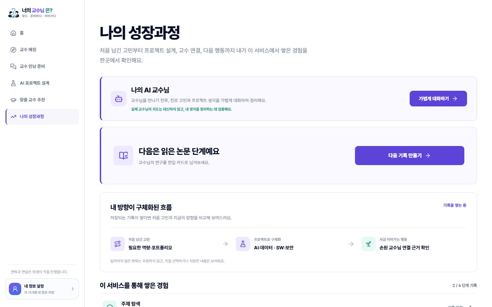

*사용자가 실제로 선택하고 저장한 정보만 시간의 흐름에 따라 남긴다.*

---

## AI가 판단하는 서비스가 아니라, 학생이 판단할 수 있게 돕는 서비스

현재 서비스에서는 정보를 다음처럼 구분한다.

- **사용자 확인**: 학생이 직접 입력하거나 선택한 내용
- **공식 근거**: 학교 공식 프로필에서 확인한 교수·연구 정보
- **AI 제안**: 학생 입력과 제공된 근거를 바탕으로 만든 질문과 방향
- **확인 필요**: 공식 정보만으로 확정할 수 없어 직접 확인해야 하는 내용

교수 궁합 점수와 순위는 제거했다. 교수의 면담 가능 여부, 학생 모집 여부, 프로젝트 성공 가능성도 AI가 추정하지 않는다. AI는 학생을 대신해 결정하는 존재가 아니라, 고민과 근거를 정리해 다음 질문을 만드는 조력자다.

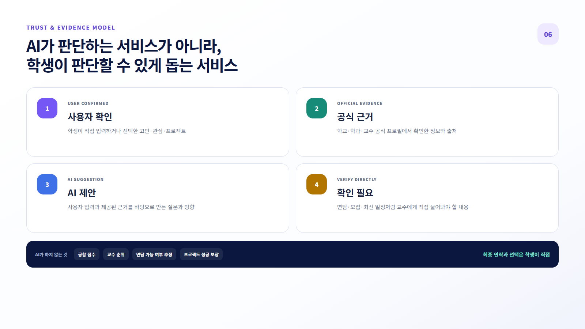

*AI가 확정하지 않는 정보의 경계를 표시하고, 최종 연락과 선택은 학생이 직접 하도록 설계했다.*

---

## 오늘 확인한 것과 아직 확인해야 할 것

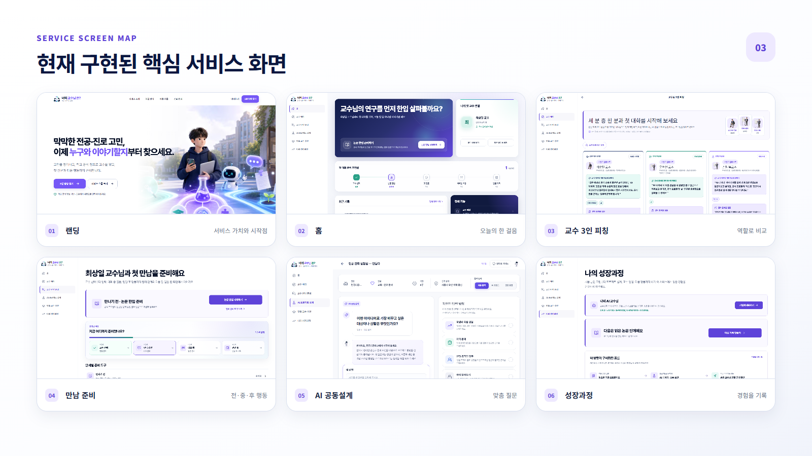

*현재 구현된 핵심 화면을 하나의 서비스 맵으로 정리했다.*

오늘 구현한 흐름은 PC와 390px 모바일 화면에서 직접 확인했다. 프로덕션 빌드와 교수 매칭·공동설계·내비게이션·프로필·성장 기록 관련 자동 테스트 34개도 통과했다.

하지만 이것을 곧바로 ‘학생 사용성이 입증됐다’고 말할 수는 없다. 현재 확인된 것은 구현과 내부 시나리오 검증이다.

다음 단계에서는 실제 대학생을 대상으로 다음 구간을 확인할 예정이다.

- 첫 화면에서 시작 방법을 바로 이해하는가?
- 기본 교수 매칭을 끝까지 완료하는가?
- 교수 선택 후 대화 준비 도구로 자연스럽게 이동하는가?
- 프로젝트 설계에서 가장 많이 멈추는 단계는 어디인가?
- AI 제안과 공식 근거, 확인 필요 항목을 구분해 이해하는가?

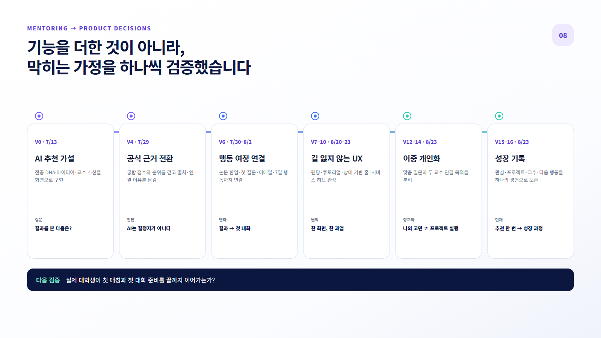

*기능을 많이 더하는 대신, 사용자가 막히는 가정을 하나씩 확인하며 서비스의 중심을 ‘추천’에서 ‘성장 과정’으로 옮겼다.*

---

## 마무리

처음에는 AI가 더 많은 답을 주는 서비스가 좋은 서비스라고 생각했다. 멘토링과 반복 구현을 거치며 생각이 바뀌었다.

학생에게 필요한 것은 화려한 추천 결과가 아니라, 자신의 고민을 말로 정리하고 믿을 수 있는 근거를 확인한 뒤 실제 사람과 대화를 시작할 수 있는 작은 다음 행동이었다.

오늘의 개발은 기능을 더 많이 보여주는 작업이 아니었다. 긴 화면을 나누고, 숨은 다음 행동을 꺼내고, AI의 말을 다시 쓰고, 사용자가 직접 판단해야 할 경계를 분명히 하는 작업이었다.

> ‘너의 교수님은?’은 AI가 진로의 답을 대신하는 서비스가 아니다. 학생이 믿을 수 있는 근거를 가지고 교수와 첫 대화를 시작하도록 돕는 서비스다.

이번처럼 아이디어를 실제 서비스로 옮기는 과정을 직접 경험해 보고 싶다면, **[코덱스 X 클로드 바이브코딩 강의](https://bit.ly/4vGYEgi)**에서 작은 MVP를 정의하고 AI와 완성하는 흐름부터 시작해 볼 수 있다.

---

### 썸네일 문구

**추천 앱에서, 첫 대화를 만드는 서비스로**
AI 대학생 진로·교수 연결 서비스 최종 개발기

### 태그

#너의교수님은 #전공진화소 #팀트리온 #UNIKER #커널아카데미 #AI서비스 #MVP #UXUI #대학생진로 #교수매칭 #프로젝트개발 #프로덕트디자인 #코덱스 #클로드 #바이브코딩
