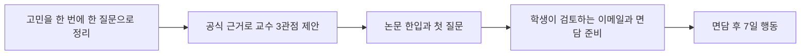

# 최종발표용 제품 성장 스토리

기준일: 2026-08-23
서비스: 전공진화소 · 너의 교수님은?
팀: 트리온 — 팀장 이연수, 팀원 최현규·이진재

## 1. 발표에서 말할 한 문장

> 처음에는 AI가 학생에게 아이디어와 교수를 추천하는 앱을 만들었습니다. 멘토링을 거치며 질문을 바꿨습니다. “무엇을 추천할까?”가 아니라 “학생이 실제 교수와 첫 대화를 시작하고, 그 조언을 다음 행동으로 옮기려면 무엇이 필요한가?”를 제품의 중심에 놓았습니다.

핵심은 기능의 양이 아니라 판단의 변화다.

- 초기: AI가 답과 점수를 보여주는 추천 중심
- 현재: 학생이 고민을 정리하고, 공식 근거를 확인하고, 교수와 직접 대화하도록 돕는 연결 중심
- 다음: 실제 학생 사용성 검증으로 막히는 구간과 다음 행동 전환을 측정

## 2. 발표용 버전 타임라인

아래 버전명은 발표 이해를 위한 제품 단계명이다. 실제 구현 근거는 날짜와 커밋으로 추적한다.

| 발표 버전 | 시기 | 당시 질문과 한계 | 받은 피드백·판단 | 제품 변화 | 발표에서 보여줄 증거 |
| --- | --- | --- | --- | --- | --- |
| V0 · 최초 기획 | 7/13 | “AI가 내 전공에 맞는 아이디어와 교수를 추천하면 도움이 되지 않을까?” | 추천 결과만으로는 실제 행동이 시작되지 않음 | 인터랙티브 프로토타입으로 가설을 화면화 | 초기 화면 또는 최초 기획서 1장, `4f2d4da` |
| V1 · AI 추천 실험 | 7/14 | 개인화된 연구 여정과 논문·실행 기능을 연결 | AI 결과의 풍부함보다 근거와 사용자의 다음 행동이 중요 | OpenAI 분석, 논문·실행 워크플로 구현 | 초기 AI 결과 화면, `b5827be`, `c03f77d` |
| V2 · 작은 과제 MVP | 7/18 | 모든 기능을 설명하기보다 핵심 선택을 빠르게 보여주고 싶음 | 복잡한 전체 앱과 검증용 최소 흐름을 구분할 필요 | 조건 선택 → 근거 기반 후보 비교의 2화면 MVP, `/research` 분리 | 당시 2화면과 현재 흐름 비교, `46316c7`, `898da9b` |
| V3 · 교수 연결 전환 | 7/28 | 연구 추천만으로 대학생의 전공·진로 고민을 충분히 다루기 어려움 | 교수의 전문성과 학생의 실행을 연결하는 방향으로 문제를 재정의 | 단국대 공식 교수 데이터, 교수 매칭, 질문형 공동설계 연결 | 공식 데이터 범위와 교수 연결 화면, `4676022` |
| V4 · 멘토링 반영 Core V2 | 7/29 | 궁합도·순위·실현성 점수가 결정을 대신하는 인상을 줌 | 확인하지 못한 능력·성공 가능성을 수치로 단정하지 않기 | 점수·순위 제거, 찾다·만들다·잇다 3기능, 공식 근거 규칙, 주제·방법·확장 3관점 | 같은 교수 결과의 전/후 비교, `0fbc96d`, `45d6afd`, `f8ac3b5` |
| V5 · 기본/심층 입력 | 7/30 | 학생마다 전공·진로·만남 상황이 다르지만 긴 폼은 시작 장벽 | 기본 정보로 시작하고 더 자세한 질문 준비는 선택권으로 제공 | 2단계 교수 찾기, 심층 맥락은 공식 근거가 아닌 면담 질문에만 반영 | 기본 분석 ↔ 심층 분석 분기, `802789d` |
| V6 · 행동까지 이어지는 MVP | 7/30–8/2 | 교수 목록을 보는 것만으로 실제 만남이 준비되지는 않음 | 연결 이유, 논문 이해, 첫 질문, 이메일, 면담 이후 행동이 하나의 여정이어야 함 | 전용 3인 피칭, 논문 한입, 퀘스트, 저장·복원, 포트폴리오, 응답 성능 개선 | 교수 피칭 → 첫 대화 준비 → 7일 행동 데모, `cdc087d`; 교수 찾기 2.3초→0.15초 `1546439` |
| V7 · 처음 온 학생의 진입 완성 | 8/20 | 기능은 구현됐지만 첫 방문자가 어디서 시작할지 바로 알기 어려움 | 랜딩은 서비스 가치와 흐름을 설명하고, 튜토리얼은 한 번에 한 질문으로 첫 매칭까지 이끌어야 함 | 공용 랜딩페이지, 3분 튜토리얼, 기본/심층 선택, 새로고침 임시복구, 실제 매칭 연결, 공식 로고·UI 시스템 통일 | 랜딩 CTA → 튜토리얼 → 첫 교수 피칭의 연속 시연, 데스크톱·390px 전후 비교, `69c2879` 이후 현재 브랜치 |
| V8 · 상태 기반 서비스 허브 | 8/23 | 기능이 많아진 뒤 홈에서 사용자가 다시 어디로 가야 할지 판단해야 했음 | 대시보드는 기능 목록이 아니라 현재 상태에 맞는 다음 행동 하나를 제안해야 함 | 오늘의 다음 행동, 첫 교수 연결, 준비 진행률, 실제 최근 기록, 전체 기능으로 홈 재설계. 튜토리얼 고민을 연구주제 생성 없이 이메일·면담 기록까지 연결 | 빈 상태 → 첫 교수 선택 → 논문 → 첫 질문 → 이메일 → 면담 후 행동에 따라 달라지는 홈, PC·390px 시안·실제 렌더 비교 |
| V9 · 전공 아이디어 진입 개선 | 8/23 | 전공 아이디어 기능만 다시 긴 조건 입력 폼으로 시작해, 처음 온 학생이 어디부터 답할지 판단해야 했음 | 교수 찾기에서 검증한 ‘한 번에 한 맥락’ 원칙을 선택적 심화 기능에도 일관되게 적용 | 전공 → 탐색 방식 → 관심 → 경험·방법 → 기간·자료 → 최종 확인의 6단계 튜토리얼. 최종 확인 전에는 기존 교수 연결·성장 기록을 유지하고, 긴 폼을 선호하면 한 화면 입력으로 전환 | `/research/tutorial` PC·390px, 마지막 확인 화면, 공동설계 진입 후 기존 `/co-design` 연결 |
| V10 · 판단량을 줄인 서비스 구조 | 8/23 | 기능을 연결한 뒤 교수 찾기·대화 준비·성장 기록 첫 화면에 설명·도구·편집 기능이 다시 쌓였음 | 토스의 쉬운 질문·불필요한 행동 제거와 당근의 개인화·공통 패턴을 공식 자료로 확인하고 구조 원칙으로 적용 | `허브 → 오늘의 한 과업 → 전용 상세`로 분리. 모바일 하단 메뉴를 통일하고 긴 입력·전체 도구·편집·삭제는 별도 주소로 이동 | `/professors`, `/quest`, `/portfolio` 한 화면 전후 비교와 `design/service-hubs-v1/` PC·390px 시안·렌더 |
| V11 · AI 티를 지운 디자인 시스템 | 8/23 | 기능 구조는 단순해졌지만 보라 그라데이션·큰 둥근 카드·강한 그림자·로봇 장식 등 생성형 템플릿의 흔적이 남음 | 디자이너 영상·Toss/Material/Atlassian 등 디자인 시스템·개발자 커뮤니티를 교차 검토해 문제는 장식 부족이 아니라 시각 규칙의 불일치임을 확인 | 8px 간격, 8/12/16px 반경, 단색 CTA, 기본 그림자 제거, 열린 목록, 동일 outline 아이콘으로 공통 토큰 재정의. 튜토리얼 장면에서 로봇과 발광선을 제거하고 모바일에서는 제목·설명을 이미지 위에 합쳐 공간을 압축 | `/tutorial`, `/professors`의 1440×900·390×844 전후 비교와 `design/front-polish-v1/` 리서치·시안·렌더 |
| V12 · 질문과 교수 역할의 이중 개인화 | 8/23 | `AI 공동설계`라는 이름과 달리 질문 5개가 사실상 고정되어 있었고, 학생 고민용 교수 연결과 프로젝트 멘토 연결의 목적이 섞여 있었음 | 비교 가능한 최소 공통 질문은 유지하되, AI는 사용자의 답에 반응해야 하며 두 교수 연결의 성공 기준을 분리해야 함 | 공통 3문항 뒤 OpenAI가 맞춤 후속 2문항 생성. 첫 교수 연결은 학생 고민 기준을 유지하고, 아이디어 선택 뒤에는 공식 후보만 AI가 주제·방법·확장 역할로 재정렬하는 프로젝트 멘토 연결 적용 | 실제 API 맞춤 질문 2개, `ai-reranked` 교수 3명과 `official-rules` 첫 교수 연결 비교, 실패 시 두 대체 경로 시연 |
| V13 · 두 여정이 보이는 내비게이션 | 8/23 | 기능명 중심 탭에서는 교수 연결과 프로젝트 연결의 선후관계가 한눈에 보이지 않았음 | 탭도 기능 목록이 아니라 사용자가 달성할 목표 순서로 읽혀야 함 | `교수 매칭 → 교수 만남 연계`, `AI 프로젝트 설계 → 맞춤 교수 추천`의 두 흐름으로 재배치. 마지막 탭은 진행 상태에 따라 설계 시작·후보 선택·추천 근거 중 필요한 다음 행동을 보여주는 전용 허브로 구성 | 모바일 하단 탭 순서, PC 좌측 메뉴, `/project-professors`의 시작 전·후보 선택 전·추천 완료 상태 비교 |
| V14 · 가까운 교수부터 시작하는 3인 피칭 | 8/23 | 세 역할을 같은 무게로 보여줘 어떤 교수를 먼저 선택해야 하는지, 선택 뒤 어디로 가는지 판단이 복잡했음 | 학생은 본인 학과 교수에게 상대적으로 맥락을 설명하고 접근하기 쉽다. 첫 접점을 현실적인 거리로 설계하되 타 학과의 전문성도 놓치지 않아야 함 | 같은 학과 교수 1명을 `가까운 시작점`으로 먼저 제안하고, 타 학과 주제형·방법형 2명을 이어서 제안. 카드의 보조 근거·도구는 접고 `이 교수님과 첫 대화 준비하기` 한 개를 주 행동으로 만들어 `/quest`에 바로 연결 | `/professors/pitch`의 세 역할 순서·학과 구분, 접힌 상세 정보, CTA 한 번으로 `/quest`에 이동하는 모바일·PC 시연 |
| V15 · 학생이 직접 확인하는 성장 기록 | 8/23 | 프로젝트를 다시 설계하면 이전 교수·프로젝트 상태가 현재 결과에 덮여, 학생이 자신이 무엇을 탐색하고 선택했는지 한눈에 보기 어려웠음 | 서비스의 가치는 추천 결과 한 번이 아니라 고민이 질문·프로젝트·교수 연결·행동으로 구체화되는 경험에도 있음 | `나의 성장과정`을 독립 탭으로 승격. 첫 관심·진로 고민, 선택 프로젝트, 학생/프로젝트 교수 매칭을 현재 상태와 분리해 보존하고 실제 저장 기록만 흐름으로 표시 | `/portfolio`의 관심 출발점 → 프로젝트 구체화 → 다음 행동, 프로젝트 설계 이력, 연결 교수 목록과 PC·모바일 시연 |
| V16 · 교수 사이의 공백을 잇는 AI 성장 파트너 | 8/23 | 실제 교수는 중요한 조언을 줄 수 있지만 학생의 모든 고민과 프로젝트 과정을 수시로 함께 정리하기는 어렵고, 학생은 면담 전후 다시 혼자 막힐 수 있음 | AI가 교수를 흉내 내거나 답을 대신해서는 안 되지만, 학생이 자기 말을 정리하고 다음 질문·행동을 준비하는 상시 사고 파트너는 될 수 있음 | 성장 기록 안에 `나의 AI 교수님`을 추가. 저장된 전공·관심·프로젝트·교수 연결만 참고해 가볍게 대화하고, 사용자가 고른 요약만 성장 메모로 남긴 뒤 실제 교수 만남 준비 또는 프로젝트 설계로 연결 | `/portfolio → /portfolio/ai-professor` 대화, 맞춤 응답, `성장 메모로 남기기`, 실제 교수 만남 준비 CTA, 대화·메모 개별 삭제 시연 |

## 3. 성장의 핵심 전환 세 가지

### 전환 1 — 연구 추천에서 대학생활의 방향 설계로

초기에는 연구 아이디어 추천이 앞에 있었다. 그러나 대학생의 더 넓은 문제는 “연구 주제가 없어서”만이 아니라, 전공·수업·프로젝트·취업·대학원 사이에서 누구에게 무엇을 물어볼지 모르는 데 있었다.

그래서 현재 서비스의 역할을 다음처럼 바꿨다.

> 교수를 검색하거나 활용하는 앱이 아니라, 학생의 고민과 교수의 전문성을 첫 대화로 연결하는 서비스

### 전환 2 — AI의 판단에서 공식 근거와 학생의 선택으로

초기 점수형 화면은 이해하기 쉬웠지만, 궁합·우열·성공 가능성을 확인하지 못한 상태에서 숫자로 단정하는 문제가 있었다. 멘토링 이후 점수와 순위를 제거하고 다음을 남겼다.

- 대학 공식 프로필과 출처
- 학생의 관심과 교수 전문 분야가 만나는 연결 이유
- 교수에게 직접 확인해야 하는 질문
- 연락 전 학생의 검토와 최종 선택

AI는 결정자가 아니라 고민·근거·질문을 정리하는 조력자로 위치를 바꿨다.

### 전환 3 — 결과 화면에서 실제 행동 여정으로

교수 후보를 보여주는 것으로 끝내지 않고 다음 흐름을 연결했다.

튜토리얼은 이 여정의 입구를 완성했고, 상태 기반 홈은 재방문 흐름을 완성했다. 첫 방문자는 기본 질문만으로 시작하고, 돌아온 학생은 기능 목록을 다시 해석하지 않아도 현재 미완료 단계 하나를 바로 이어갈 수 있다.

전공 아이디어처럼 선택적인 심화 기능도 같은 원칙으로 다듬었다. 긴 조건표를 다시 보여주지 않고 전공·관심·가능 조건을 한 맥락씩 확인한다. 학생이 마지막 확인을 누르기 전에는 이미 만든 교수 연결과 성장 기록을 바꾸지 않는다.

## 4. 최종발표 시연 시나리오

권장 시연 시간: 2분 30초~3분

1. **랜딩 오프닝 — 20초**
   - “교수 정보는 많지만, 내 고민을 누구에게 왜 이야기할지는 흩어져 있습니다.”
   - 랜딩의 문제 → 해결 → `3분 방향 찾기` CTA를 보여준다.
2. **튜토리얼 — 55초**
   - 전공, 현재 단계, 필요한 도움, 관심 분야, 고민을 한 번에 하나씩 선택한다.
   - “기본 정보만으로 바로 볼 수도 있고, 2분 더 알려주면 첫 질문을 구체화합니다.”라고 설명한다.
   - 심층 입력이 교수 근거를 임의로 강화하지 않는다는 신뢰 문구를 짚는다.
3. **첫 교수 피칭 — 45초**
   - 본인 학과 교수 한 명은 `가까운 시작점`, 다른 학과 두 명은 `주제 연결형·방법 연결형`으로 제안한 이유를 말한다.
   - 이는 순위가 아니라 접근 가능성과 전문성의 선택지이며, 공식 출처와 직접 확인할 점을 펼쳐 보여준다.
   - `이 교수님과 첫 대화 준비하기`를 눌러 별도 판단 없이 다음 단계로 이동한다.
4. **상태 기반 홈 — 20초**
   - 교수를 선택하면 홈이 `논문 한입`을 오늘의 다음 행동으로 바꾸는 모습을 보여준다.
   - “기능을 나열한 대시보드가 아니라, 멈춘 지점에서 다음 한 걸음을 제안합니다.”라고 설명한다.
5. **첫 대화 준비 — 35초**
   - 논문 한입, 첫 질문, 학생이 검토하는 이메일 초안 중 핵심 한 가지만 시연한다.
6. **다음 행동 — 20초**
   - 면담 후 7일 행동으로 이어지는 화면을 보여준다.
7. **성장 타임라인 — 25초**
   - 초기 점수형 추천 화면과 현재 공식 근거·질문형 화면을 나란히 제시한다.
   - “멘토링을 통해 기능을 더한 것이 아니라, 확인할 수 없는 판단을 빼고 실제 대화와 행동을 연결했습니다.”로 정리한다.

## 5. 90초 발표 원고

> 저희의 첫 기획은 AI가 학생의 전공을 분석해 연구 아이디어와 잘 맞는 교수를 추천하는 앱이었습니다. 화면은 화려했지만, 두 가지 질문에 답하지 못했습니다. 이 점수는 무엇을 근거로 했는가, 그리고 추천을 본 학생은 실제로 무엇을 하는가였습니다.
>
> 매주 멘토링과 구현 검증을 거치며 서비스의 중심을 바꿨습니다. 궁합도와 교수 순위를 제거하고, 단국대학교 공식 교수 정보와 출처, 연결 이유, 교수에게 직접 확인할 질문을 남겼습니다. 연구만이 아니라 수업·프로젝트·취업·대학원 고민을 교수와 함께 설계할 수 있도록 범위도 확장했습니다.
>
> 그리고 오늘은 그 성장의 마지막 입구를 보여드립니다. 처음 방문한 학생은 긴 폼 앞에서 헤매지 않습니다. 한 번에 한 질문씩 고민을 정리하고, 기본 정보로 바로 첫 매칭을 보거나 2분 더 입력해 첫 질문을 구체화할 수 있습니다. 이후 교수의 공개 논문을 이해하고, 이메일과 면담을 준비하고, 받은 조언을 7일 행동으로 옮깁니다.
>
> 다시 방문했을 때도 길을 잃지 않습니다. 홈은 기능을 같은 크기로 나열하지 않고, 실제 저장 상태를 읽어 오늘 해야 할 행동 하나를 가장 먼저 보여줍니다. 연구주제를 만들지 않은 학생도 튜토리얼에서 정리한 고민으로 첫 질문과 면담 기록까지 계속 이어갈 수 있습니다.
>
> 교수 찾기·대화 준비·성장 기록의 첫 화면도 같은 원칙으로 정리했습니다. 모든 도구와 설정을 한 화면에 쌓지 않고, 지금 해야 할 행동 하나와 짧은 목록만 보여준 뒤 상세 기능은 눌러서 들어가도록 분리했습니다.
>
> 마지막으로 생성형 도구가 자동으로 붙이던 그라데이션, 큰 둥근 카드, 로봇 장식을 그대로 두지 않았습니다. 디자인 자료와 커뮤니티 피드백을 기준으로 8픽셀 간격과 한 종류의 반경·아이콘·강조색을 정하고, 학생의 고민과 다음 행동이 가장 먼저 보이게 화면을 다시 다듬었습니다.
>
> 전공진화소는 AI가 진로의 답을 대신하는 서비스가 아닙니다. 학생이 믿을 수 있는 근거를 가지고 교수와 첫 대화를 시작하도록 돕는 서비스입니다.

## 6. 한 장 슬라이드 구성

제목: **추천 앱에서, 첫 대화를 만드는 서비스로**

| 처음 | 멘토링에서 던진 질문 | 지금 |
| --- | --- | --- |
| AI 아이디어 추천 | 이 결과를 왜 믿어야 하는가? | 공식 출처와 연결 이유 |
| 교수 궁합 점수·순위 | 확인하지 못한 판단을 숫자로 보여도 되는가? | 주제·방법·확장 3관점 |
| 연구 중심 사용자 | 대학생은 실제로 어떤 순간에 막히는가? | 전공·수업·프로젝트·진로 고민 |
| 결과 카드에서 종료 | 학생의 다음 행동은 무엇인가? | 질문·이메일·면담·7일 행동 |
| 복잡한 첫 입력 | 처음 온 학생이 길을 잃지 않는가? | 3분 질문형 튜토리얼 |
| 같은 비중의 기능 카드 | 다시 온 학생이 다음 행동을 바로 아는가? | 상태 기반 오늘의 한 걸음 |

하단 한 문장:

> 매주 기능을 더한 것이 아니라, 사용자의 실제 행동을 막는 가정을 하나씩 검증하고 제품의 중심을 다시 세웠습니다.

## 7. 발표할 때 지켜야 할 근거 경계

- `사용자가 검증했다`, `효과가 입증됐다`고 말하지 않는다. 현재 확인된 것은 구현과 내부 시나리오 검증이다.
- 멘토가 긍정적으로 본 것은 교수 논문 이해·질문·행동 자료의 방향이다. 전체 E2E를 최종 승인했다고 표현하지 않는다.
- 교수 정보는 공식 프로필 공개 범위이며, 면담 가능 여부·학생 모집 여부·최신 시간표를 예측하지 않는다.
- 교수 찾기 성능 수치는 같은 구현 환경의 회귀 측정값으로 설명한다.
- 다음 검증 계획은 첫 매칭 완료율, 첫 멈춤 단계, 심층 입력 선택률, 첫 대화 준비 도구 진입률로 제시할 수 있지만 아직 실측값처럼 말하지 않는다.

## 8. 구현 근거 색인

- 최초 인터랙티브 프로토타입: `4f2d4da`
- AI 여정·논문·실행 흐름: `b5827be`, `c03f77d`
- 2화면 과제 MVP: `46316c7`, `898da9b`
- 단국대 공식 데이터와 교수 매칭: `4676022`
- Core V2와 근거 규칙: `0fbc96d`, `45d6afd`, `f8ac3b5`
- 기본/심층 교수 찾기: `802789d`
- 전용 교수 3인 피칭: `cdc087d`
- 공개 랜딩페이지: `69c2879` 및 2026-08-20 후속 개선
- 튜토리얼 UI 시스템·생성형 공식 로고: `design/tutorial-v2/` 및 2026-08-20 현재 브랜치
- 상태 기반 홈·서비스 연결·PC/모바일 검수: `design/home-dashboard-v2/` 및 `docs/SERVICE_FLOW.md`
- 전공 아이디어 6단계 튜토리얼·임시저장·PC/모바일 검수: `design/research-tutorial-v1/` 및 `/research/tutorial`
- 토스·당근 구조 레퍼런스 기반 서비스 허브·공통 하단 내비·전용 상세 분리: `design/service-hubs-v1/`
- 제품 판단 문서: `docs/PRODUCT_PLAN_2026-07-28.md`
- Core V2 인계: `docs/CORE_V2_REFACTOR_HANDOFF_2026-07-29.md`
- 2단계 교수 찾기 인계: `docs/PROFESSOR_DISCOVERY_TWO_STAGE_HANDOFF_2026-07-29.md`
